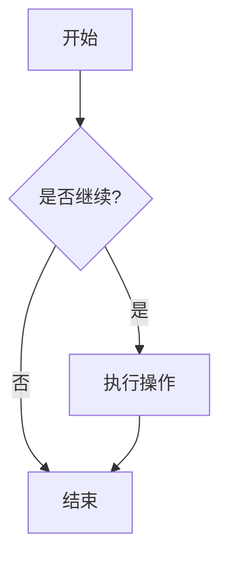
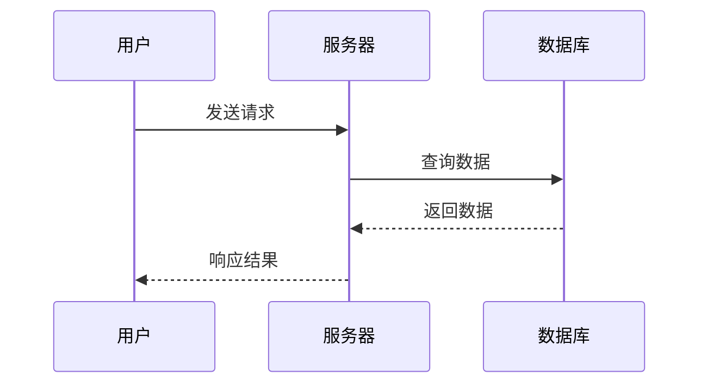
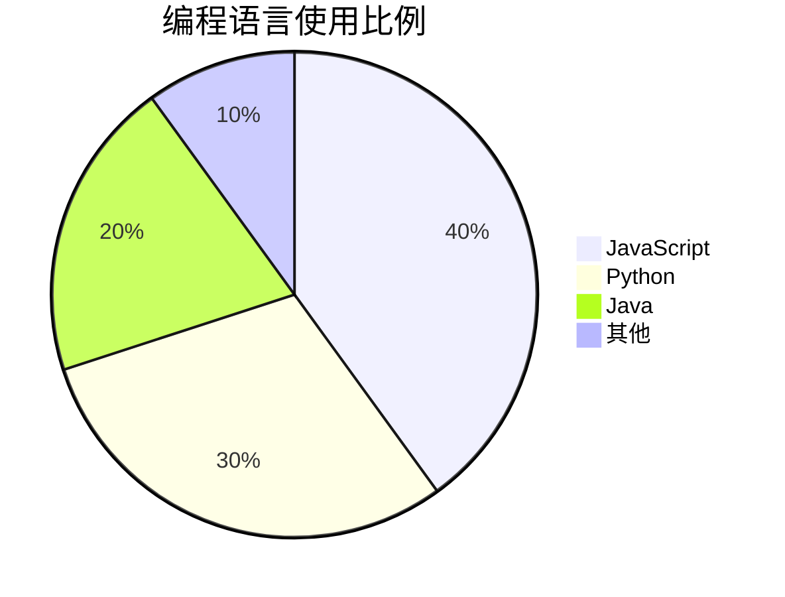
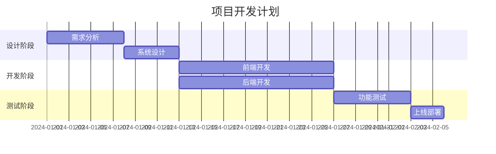
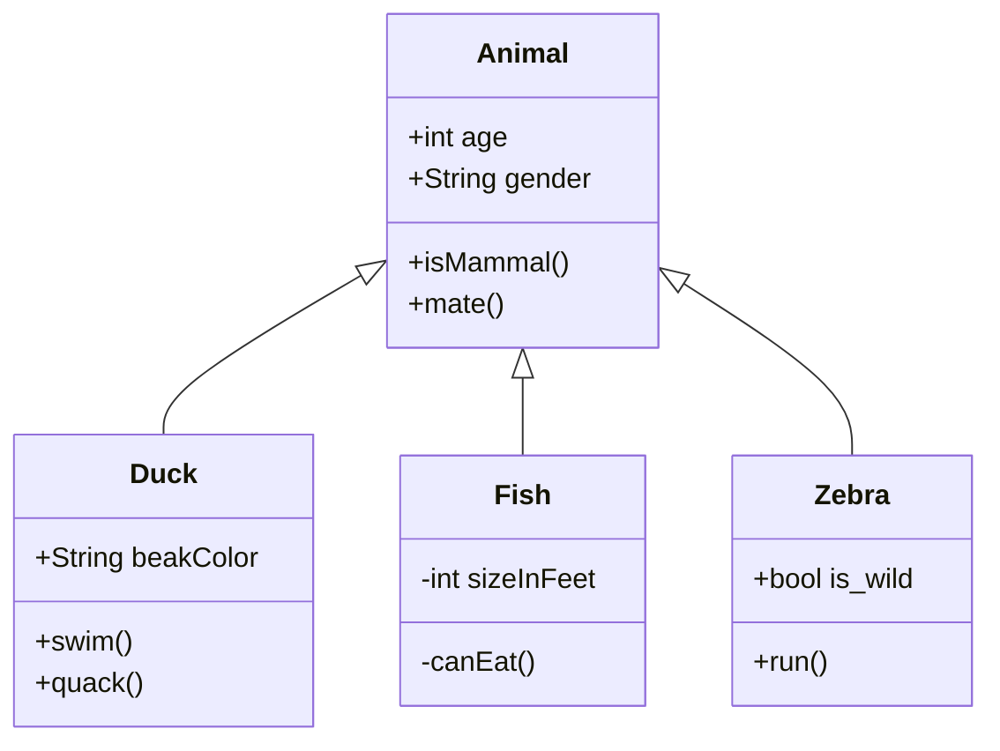

# Markdown 从入门到精通

> 一份全面、详细的 Markdown 语法指南，涵盖所有常用和高级语法。

---

## 目录

1. [什么是 Markdown](#什么是-markdown)
2. [基础语法](#基础语法)
   - [标题](#标题)
   - [段落](#段落)
   - [换行](#换行)
   - [强调](#强调)
   - [删除线](#删除线)
   - [引用](#引用)
   - [列表](#列表)
   - [代码](#代码)
   - [分割线](#分割线)
   - [链接](#链接)
   - [图片](#图片)
   - [转义字符](#转义字符)
3. [扩展语法](#扩展语法)
   - [表格](#表格)
   - [任务列表](#任务列表)
   - [删除线](#删除线-1)
   - [代码块与语法高亮](#代码块与语法高亮)
   - [脚注](#脚注)
   - [定义列表](#定义列表)
   - [缩写](#缩写)
4. [高级技巧](#高级技巧)
   - [HTML 元素](#html-元素)
   - [数学公式](#数学公式)
   - [流程图](#流程图)
   - [Mermaid 图表](#mermaid-图表)
   - [目录生成](#目录生成)
5. [最佳实践](#最佳实践)

---

## 什么是 Markdown

Markdown 是一种轻量级标记语言，由 John Gruber 于 2004 年创建。它允许人们使用易读易写的纯文本格式编写文档，然后转换成有效的 HTML 文档。

**优点：**
- 纯文本格式，兼容性强
- 语法简单，学习成本低
- 关注内容而非格式
- 可版本控制
- 跨平台使用

---

## 基础语法

### 标题

Markdown 支持六级标题，使用 `#` 号表示。

**语法：**
```markdown
# 一级标题
## 二级标题
### 三级标题
#### 四级标题
##### 五级标题
###### 六级标题
```

**演示效果：**

# 一级标题
## 二级标题
### 三级标题
#### 四级标题
##### 五级标题
###### 六级标题

> **注意：** `#` 号后面需要加一个空格，这是标准 Markdown 语法。

---

### 段落

段落由一行或多行文本组成，段落之间用空行分隔。

**语法：**
```markdown
这是第一个段落。段落可以包含多行文本，
只要没有空行分隔，就属于同一个段落。

这是第二个段落。两个段落之间有一个空行。
```

**演示效果：**

这是第一个段落。段落可以包含多行文本，
只要没有空行分隔，就属于同一个段落。

这是第二个段落。两个段落之间有一个空行。

---

### 换行

在段落内换行有两种方式：

**方式一：使用两个空格 + 回车**
```markdown
第一行（后面有两个空格）
第二行
```

**方式二：使用 HTML 的 `<br>` 标签**
```markdown
第一行<br>第二行
```

**演示效果：**

第一行（后面有两个空格）
第二行

---

### 强调

Markdown 提供三种强调方式：粗体、斜体、粗斜体。

**语法：**
```markdown
**粗体文本**
__粗体文本__

*斜体文本*
_斜体文本_

***粗斜体文本***
___粗斜体文本___

**粗体中包含*斜体*文本**
```

**演示效果：**

**粗体文本**
__粗体文本__

*斜体文本*
_斜体文本_

***粗斜体文本***
___粗斜体文本___

**粗体中包含*斜体*文本**

---

### 删除线

使用双波浪线表示删除线。

**语法：**
```markdown
~~这段文字被删除了~~
```

**演示效果：**

~~这段文字被删除了~~

---

### 引用

使用 `>` 符号创建引用块，支持嵌套。

**语法：**
```markdown
> 这是一级引用
>
> > 这是二级引用
> >
> > > 这是三级引用

> 引用中可以包含其他 Markdown 元素
>
> - 列表项一
> - 列表项二
>
> **粗体文本**
```

**演示效果：**

> 这是一级引用
>
> > 这是二级引用
> >
> > > 这是三级引用

> 引用中可以包含其他 Markdown 元素
>
> - 列表项一
> - 列表项二
>
> **粗体文本**

---

### 列表

#### 无序列表

使用 `*`、`+` 或 `-` 作为列表标记。

**语法：**
```markdown
* 项目一
* 项目二
  * 子项目 2.1
  * 子项目 2.2
* 项目三

+ 项目 A
+ 项目 B

- 项目 X
- 项目 Y
```

**演示效果：**

* 项目一
* 项目二
  * 子项目 2.1
  * 子项目 2.2
* 项目三

#### 有序列表

使用数字加点表示有序列表。

**语法：**
```markdown
1. 第一项
2. 第二项
3. 第三项
   1. 子项 3.1
   2. 子项 3.2
4. 第四项
```

**演示效果：**

1. 第一项
2. 第二项
3. 第三项
   1. 子项 3.1
   2. 子项 3.2
4. 第四项

> **提示：** 列表序号可以不按顺序，Markdown 会自动排序。

#### 列表嵌套

**语法：**
```markdown
1. 第一项
   - 子项 1.1
   - 子项 1.2
2. 第二项
   - 子项 2.1
     - 子子项 2.1.1
```

**演示效果：**

1. 第一项
   - 子项 1.1
   - 子项 1.2
2. 第二项
   - 子项 2.1
     - 子子项 2.1.1

---

### 代码

#### 行内代码

使用反引号包裹代码片段。

**语法：**
```markdown
使用 `printf()` 函数输出内容。
```

**演示效果：**

使用 `printf()` 函数输出内容。

#### 代码块

使用三个反引号包裹代码块，可指定语言实现语法高亮。

**语法：**
````markdown
```python
def hello_world():
    print("Hello, World!")

hello_world()
```
````

**演示效果：**
```python
def hello_world():
    print("Hello, World!")

hello_world()
```

**支持的语言示例：**

```javascript
// JavaScript 示例
const greeting = "Hello, Markdown!";
console.log(greeting);
```

```java
// Java 示例
public class Main {
    public static void main(String[] args) {
        System.out.println("Hello, Markdown!");
    }
}
```

```c
// C 语言示例
#include <stdio.h>

int main() {
    printf("Hello, Markdown!\n");
    return 0;
}
```

```cpp
// C++ 示例
#include <iostream>

int main() {
    std::cout << "Hello, Markdown!" << std::endl;
    return 0;
}
```

```sql
-- SQL 示例
SELECT * FROM users WHERE status = 'active';
```

```json
{
  "name": "Markdown Tutorial",
  "version": "1.0.0",
  "author": "Jerry"
}
```

---

### 分割线

使用三个或更多的 `*`、`-` 或 `_` 创建分割线。

**语法：**
```markdown
***

---

___
```

**演示效果：**

上面的分割线

***

中间的分割线

---

下面的分割线

___

---

### 链接

#### 基本链接

**语法：**
```markdown
[链接文本](URL)

[GitHub](https://github.com)
```

**演示效果：**

[GitHub](https://github.com)

#### 带标题的链接

**语法：**
```markdown
[链接文本](URL "标题")

[GitHub](https://github.com "访问 GitHub")
```

**演示效果：**

[GitHub](https://github.com "访问 GitHub")

#### 引用式链接

**语法：**
```markdown
[链接文本][引用ID]

[引用ID]: URL "可选标题"

这是一个[引用式链接][google]

[google]: https://www.google.com "Google 搜索"
```

**演示效果：**

这是一个[引用式链接][google]

[google]: https://www.google.com "Google 搜索"

#### 直接链接

**语法：**
```markdown
<https://www.example.com>

<email@example.com>
```

**演示效果：**

<https://www.example.com>

<email@example.com>

---

### 图片

#### 基本图片

**语法：**
```markdown


```

**演示效果：**


#### 带标题的图片

**语法：**
```markdown


```

**演示效果：**


#### 引用式图片

**语法：**
```markdown
![替代文本][图片ID]

[图片ID]: 图片URL "标题"

![Markdown Logo][logo]

[logo]: https://markdown.com.cn/hero.png "Markdown Logo"
```

**演示效果：**

![Markdown Logo][logo]

[logo]: https://markdown.com.cn/hero.png "Markdown Logo"

#### 图片链接

**语法：**
```markdown
[](链接URL)

[](https://github.com)
```

**演示效果：**

[](https://github.com)

---

### 转义字符

使用反斜杠转义 Markdown 特殊字符。

**语法：**
```markdown
\* 不是斜体
\# 不是标题
\[ 不是链接
```

**演示效果：**

\* 不是斜体
\# 不是标题
\[ 不是链接

**可转义的字符：**

| 字符 | 名称 |
|------|------|
| \\ | 反斜杠 |
| \` | 反引号 |
| \* | 星号 |
| \_ | 下划线 |
| \{ \} | 花括号 |
| \[ \] | 方括号 |
| \( \) | 圆括号 |
| \# | 井号 |
| \+ | 加号 |
| \- | 减号 |
| \. | 英文句号 |
| \! | 感叹号 |
| \| | 竖线 |

---

## 扩展语法

### 表格

使用竖线和连字符创建表格。

**语法：**
```markdown
| 表头1 | 表头2 | 表头3 |
|-------|-------|-------|
| 内容1 | 内容2 | 内容3 |
| 内容4 | 内容5 | 内容6 |

### 对齐方式

| 左对齐 | 居中对齐 | 右对齐 |
|:-------|:--------:|-------:|
| 内容   | 内容     | 内容   |
| 数据   | 数据     | 数据   |
```

**演示效果：**

| 表头1 | 表头2 | 表头3 |
|-------|-------|-------|
| 内容1 | 内容2 | 内容3 |
| 内容4 | 内容5 | 内容6 |

### 对齐方式

| 左对齐 | 居中对齐 | 右对齐 |
|:-------|:--------:|-------:|
| 内容   | 内容     | 内容   |
| 数据   | 数据     | 数据   |

---

### 任务列表

创建带有复选框的任务列表。

**语法：**
```markdown
- [x] 已完成的任务
- [ ] 未完成的任务
- [ ] 另一个未完成的任务
  - [x] 子任务已完成
  - [ ] 子任务未完成
```

**演示效果：**

- [x] 已完成的任务
- [ ] 未完成的任务
- [ ] 另一个未完成的任务
  - [x] 子任务已完成
  - [ ] 子任务未完成

---

### 删除线

（已在基础语法中介绍，此处为扩展语法支持）

**语法：**
```markdown
~~删除线文本~~
```

**演示效果：**

~~删除线文本~~

---

### 代码块与语法高亮

支持多种编程语言的语法高亮。

**常用语言列表：**

| 语言 | 标识符 |
|------|--------|
| JavaScript | `javascript` 或 `js` |
| Python | `python` 或 `py` |
| Java | `java` |
| C | `c` |
| C++ | `cpp` 或 `c++` |
| C# | `csharp` 或 `cs` |
| PHP | `php` |
| Ruby | `ruby` |
| Go | `go` |
| Rust | `rust` |
| Swift | `swift` |
| Kotlin | `kotlin` |
| TypeScript | `typescript` 或 `ts` |
| HTML | `html` |
| CSS | `css` |
| SQL | `sql` |
| Shell | `shell` 或 `bash` |
| JSON | `json` |
| YAML | `yaml` |
| XML | `xml` |
| Markdown | `markdown` 或 `md` |

**更多语言示例：**

```typescript
// TypeScript 示例
interface User {
  name: string;
  age: number;
}

const greet = (user: User): string => {
  return `Hello, ${user.name}!`;
};
```

```go
// Go 示例
package main

import "fmt"

func main() {
    fmt.Println("Hello, Markdown!")
}
```

```rust
// Rust 示例
fn main() {
    println!("Hello, Markdown!");
}
```

```bash
# Bash 脚本示例
#!/bin/bash
echo "Hello, Markdown!"
```

---

### 脚注

添加脚注引用。

**语法：**
```markdown
这是一个脚注引用[^1]。

[^1]: 这是脚注的内容。
```

**演示效果：**

这是一个脚注引用[^1]。

[^1]: 这是脚注的内容。

---

### 定义列表

部分 Markdown 解析器支持定义列表。

**语法：**
```markdown
术语 1
: 定义 1

术语 2
: 定义 2a
: 定义 2b
```

**演示效果：**

术语 1
: 定义 1

术语 2
: 定义 2a
: 定义 2b

---

### 缩写

部分 Markdown 解析器支持缩写定义。

**语法：**
```markdown
HTML 是一种标记语言。

*[HTML]: Hyper Text Markup Language
```

**演示效果：**

HTML 是一种标记语言。

*[HTML]: Hyper Text Markup Language

---

## 高级技巧

### HTML 元素

Markdown 支持内嵌 HTML 元素。

**常用 HTML 元素示例：**

```markdown
<div style="color: red; font-size: 20px;">
  这是红色大号文字
</div>

<kbd>Ctrl</kbd> + <kbd>C</kbd> 复制

<mark>高亮文本</mark>

<sub>下标</sub> 和 <sup>上标</sup>
```

**演示效果：**

<div style="color: red; font-size: 20px;">
  这是红色大号文字
</div>

<kbd>Ctrl</kbd> + <kbd>C</kbd> 复制

<mark>高亮文本</mark>

H<sub>2</sub>O 和 X<sup>2</sup>

---

### 数学公式

使用 LaTeX 语法编写数学公式（需要支持 MathJax 或 KaTeX 的解析器）。

#### 行内公式

**语法：**
```markdown
质能方程 $E = mc^2$ 是物理学中最著名的公式之一。
```

**演示效果：**

质能方程 $E = mc^2$ 是物理学中最著名的公式之一。

#### 块级公式

**语法：**
```markdown
$$
\frac{-b \pm \sqrt{b^2 - 4ac}}{2a}
$$
```

**演示效果：**

$$
\frac{-b \pm \sqrt{b^2 - 4ac}}{2a}
$$

#### 更多公式示例

**求和公式：**
```markdown
$$
\sum_{i=1}^{n} x_i = x_1 + x_2 + \cdots + x_n
$$
```

**演示效果：**

$$
\sum_{i=1}^{n} x_i = x_1 + x_2 + \cdots + x_n
$$

**积分公式：**
```markdown
$$
\int_{a}^{b} f(x) \, dx
$$
```

**演示效果：**

$$
\int_{a}^{b} f(x) \, dx
$$

**矩阵：**
```markdown
$$
\begin{bmatrix}
a & b \\
c & d
\end{bmatrix}
$$
```

**演示效果：**

$$
\begin{bmatrix}
a & b \\
c & d
\end{bmatrix}
$$

---

### 流程图

使用 Mermaid 语法绘制流程图。

**语法：**
````markdown

````

**演示效果：**


---

### Mermaid 图表

#### 时序图

**语法：**
````markdown

````

**演示效果：**


#### 饼图

**语法：**
````markdown

````

**演示效果：**


#### 甘特图

**语法：**
````markdown

````

**演示效果：**


#### 类图

**语法：**
````markdown

````

**演示效果：**


---

### 目录生成

部分 Markdown 解析器支持自动生成目录。

**语法：**
```markdown
[toc]
```

或手动创建目录：

```markdown
## 目录

- [标题一](#标题一)
  - [子标题](#子标题)
- [标题二](#标题二)
```

---

## 最佳实践

### 1. 保持一致性

- 统一使用一种列表标记（推荐 `-`）
- 统一标题风格
- 统一代码块语言标识

### 2. 可读性优先

- 适当使用空行分隔内容
- 避免过长的行
- 合理使用标题层级

### 3. 链接和图片

- 使用引用式链接保持正文简洁
- 为图片提供有意义的替代文本
- 检查链接有效性

### 4. 代码块

- 始终指定语言以启用语法高亮
- 保持代码简洁、可运行
- 添加必要的注释

### 5. 表格

- 保持列对齐
- 避免过宽的表格
- 复杂数据考虑使用列表

### 6. 兼容性考虑

- 不同平台支持的语法可能不同
- 测试在目标平台的渲染效果
- 必要时使用 HTML 作为补充

---

## 快速参考卡片

```
# 标题
## 二级标题
### 三级标题

**粗体** *斜体* ***粗斜体***

~~删除线~~

> 引用

- 无序列表
1. 有序列表

- [ ] 任务列表
- [x] 已完成

`行内代码`

```语言
代码块
```

[链接](URL)


| 表格 | 表格 |
|------|------|
| 内容 | 内容 |

---

*斜体* 或 _斜体_
**粗体** 或 __粗体__

[引用式链接][id]
[id]: URL

脚注[^1]
[^1]: 脚注内容
```

---

## 结语

Markdown 是一种强大而简洁的标记语言，掌握这些语法后，你可以：

- 编写清晰的技术文档
- 创建专业的 README 文件
- 撰写博客文章
- 记录学习笔记
- 编写书籍

**推荐资源：**

- [Markdown 官方文档](https://daringfireball.net/projects/markdown/)
- [GitHub Flavored Markdown](https://github.github.com/gfm/)
- [CommonMark 规范](https://commonmark.org/)

---

*文档创建时间：2024年*
*作者：Jerry*