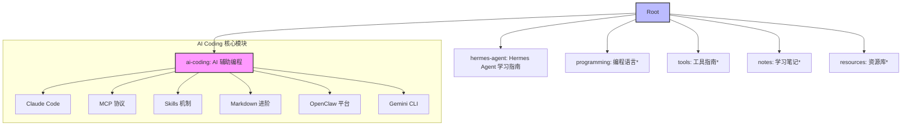

# Jerry's Knowledge Base 🧠

> **一个致力于 AI 辅助编程与个人效率落地的个人知识库。**
> 
> 本仓库由 Claude 与我（Jerry）共同管理，旨在通过精准的文档与实战案例，打通 AI 与日常工程实践的最后一步。

---

## 📁 核心目录

*注：标注 `*` 的目录目前正在筹备中。*

---

## 📚 精选文档索引

### 🚀 AI 辅助编程 (AI Coding)

| 文档 | 核心亮点 | 链接 |
|:-----|:---------|:-----:|
| **阿里云部署生产助理** | 轻量服 + `qwen-max` + 钉钉流式 + 代理转发脚本 | [查看](./ai-coding/实战篇-阿里云轻量服部署OpenClaw钉钉助理.md) |
| **大模型黑话词典** | 小白必读！告别晦涩算法，掌握结提示工程常用语 | [查看](./ai-coding/AI-Coding-实战词汇宝典.md) |
| **npm 新手必备指南** | 图文并茂！用大白话彻底搞懂 npm 那些吓人的全英文报错 | [查看](./ai-coding/新手必学-npm-与包管理完全指南.md) |
| **GitHub 入门到精通** | 零基础扫盲！用单机游戏存档的逻辑，摧毁对 Git 命令的恐惧 | [查看](./ai-coding/新手必学-GitHub-与版本控制完全指南.md) |
| **MCP Server 开发实战** | 手把手 TypeScript 编写本地读写插件 | [查看](./ai-coding/实战篇-开发我的第一个-MCP-Server.md) |
| **Claude Code 保姆指南** | 国内模型代理、新手排错、安装指引 | [查看](./ai-coding/实战篇-Claude-Code-保姆级安装与使用指南.md) |
| **Claude Code 速查手册** | CLI参数、斜杠命令、高级快捷键全指南 | [查看](./ai-coding/Claude-Code-命令与快捷键速查手册.md) |
| **MCP 协议完全通关** | TypeScript/Python 开发、多模型连接 | [查看](./ai-coding/Claude-Code-MCP-从入门到精通.md) |
| **Skills 高级进阶** | 自动化拦截 (Hooks)、子代理 (Fork) | [查看](./ai-coding/Claude-Code-Skills-从入门到精通.md) |
| **Skills 实战架构** | 五大高阶自动化工作流、API分发与工程指南 | [查看](./ai-coding/实战篇-Claude-Code-Skills-高级运用与场景实战.md) |
| **OpenClaw 全能助手** | **飞书/钉钉集成**、Canvas、本地 LLM | [查看](./ai-coding/OpenClaw-从入门到精通.md) |
| **Gemini CLI 保姆指南** | **谷歌原生 AI 助手**、多代理并行、规范约束 (GEMINI.md) | [查看](./ai-coding/实战篇-Gemini-CLI-保姆级安装与使用指南.md) |
| **Markdown 权威指南** | Mermaid、GitHub Alerts、排版规范 | [查看](./ai-coding/Markdown-从入门到精通.md) |

### 🤖 Hermes Agent 学习指南

| 文档 | 核心亮点 | 链接 |
|:-----|:---------|:-----:|
| **简介与概述** | Hermes 是什么、核心特性、与同类产品对比 | [查看](./hermes-agent/01-简介与概述.md) |
| **安装与快速开始** | 一行安装、Provider 选择、第一次对话 | [查看](./hermes-agent/02-安装与快速开始.md) |
| **核心架构解析** | 系统架构图、数据流、目录结构、设计原则 | [查看](./hermes-agent/03-核心架构解析.md) |
| **三层记忆系统** | 短期/程序性/长期记忆、Honcho 用户建模 | [查看](./hermes-agent/04-三层记忆系统.md) |
| **Skills 技能系统** | 技能创建、安装、学习闭环、自定义开发 | [查看](./hermes-agent/05-Skills技能系统.md) |
| **工具系统** | 61+ 工具、7 种终端后端、MCP 集成 | [查看](./hermes-agent/06-工具系统.md) |
| **消息平台与网关** | 15+ 平台接入、Telegram/Discord 配置 | [查看](./hermes-agent/07-消息平台与网关.md) |
| **配置与个性化** | 配置文件、SOUL.md 人格、上下文文件 | [查看](./hermes-agent/08-配置与个性化.md) |
| **高级功能** | Cron 定时、子 Agent、浏览器、语音、RL 训练 | [查看](./hermes-agent/09-高级功能.md) |
| **开发者指南** | 插件开发、添加工具、贡献代码 | [查看](./hermes-agent/10-开发者指南.md) |
| **实用场景与案例** | 社区真实用例、FAQ、最佳实践 | [查看](./hermes-agent/11-实用场景与案例.md) |

---

## 🛠️ 项目规范

### 配置说明 (CLAUDE.md)
我们在项目根目录维护了 [CLAUDE.md](./CLAUDE.md)，用于指导 AI 助手（如 Claude Code）遵循我们的项目偏好、命名规范和工作流。

### 运行建议
建议通过本地 `pi gateway` (OpenClaw) 或 `claude` (Claude Code) 开启 Agent 模式浏览本库，体验深度上下文关联。

---

## 📝 最近动态

- **2026-05-07**: 新增 `hermes-agent` 目录，完整收录 Hermes Agent 官方文档的中文学习指南（11 个章节，涵盖安装、架构、记忆、技能、工具、消息平台等全部内容）。
- **2026-03-21**: 深度优化《Markdown 从入门到精通》全语法教程，新增 AI 提示词工程（Prompt）与大模型规范（CLAUDE.md）协同等高阶指南。
- **2026-03-10**: 新增《Gemini CLI 保姆级安装与使用指南》，涵盖谷歌原生 AI 助手全指令、Token 监控及 `GEMINI.md` 规范。
- **2026-03-08**: 深度优编《GitHub 与版本控制完全指南》(增补 .gitignore/SSH/Fork/Actions/Pages)、《AI Coding 实战词汇宝典》、《npm 与包管理完全指南》(新增 nrm/nvm/package.json)、《OpenClaw 钉钉助理部署指南》。
- **2026-03-07**: 完成 `ai-coding` 系列文档深度重构，新增国内 IM 对接方案与高级扩展教程。
- **2026-03-07**: 优化项目根目录结构，引入 Mermaid 架构展示。

---

> 📅 最后更新：2026-05-07  
> 📚 GitHub Repo: [jerrys-knowledge-base](https://github.com/daruizi/jerrys-knowledge-base)