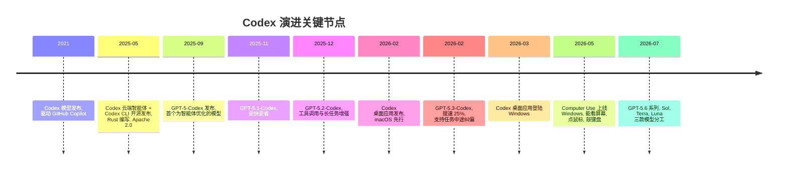
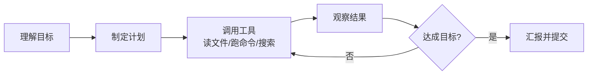
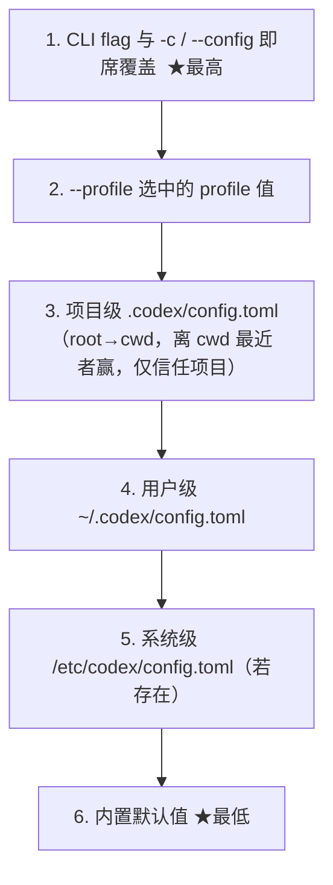
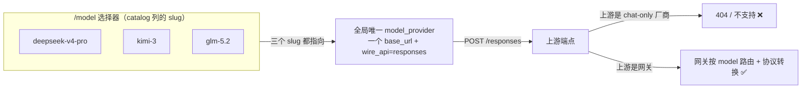

# Codex（ChatGPT）从入门到精通

> **一份写给新手的 OpenAI Codex 完全指南：认识它、装好它、配置它、驾驭它。**
>
> 本文基于真实使用环境编写：`codex-cli 0.145.0` · Windows 11 · Codex 桌面应用 · 阿里云百炼 Token Plan（Qwen 模型）· 38 个 Skills。
> 阅读对象：零基础新手 → 想深度定制的高级用户。读完即可上手。
>
> 最后更新：2026-07-24

---

## 目录

- [一、认识 Codex：它到底是什么？](#一认识-codex它到底是什么)
- [二、核心能力全景](#二核心能力全景)
- [三、与主流 Agent 的对比：差异与优势](#三与主流-agent-的对比差异与优势)
- [四、安装：十分钟搞定](#四安装十分钟搞定)
- [五、快速上手：第一次对话](#五快速上手第一次对话)
- [六、配置精通：从 config.toml 到自定义模型](#六配置精通从-configtoml-到自定义模型)
   - [6.8 配置文件的种类与六层优先级](#s6-priority)
   - [6.9 多供应商接入与三种组织方式](#s6-multi)
- [七、进阶实战：多 Agent、自动化与工程化](#七进阶实战多-agent自动化与工程化)
- [八、Windows 踩坑实录（血泪经验）](#八windows-踩坑实录血泪经验)
- [九、常见问题 FAQ](#九常见问题-faq)
- [十、附录：命令速查 · 术语表 · 资源](#十附录命令速查--术语表--资源)

---

## 一、认识 Codex：它到底是什么？

### 1.1 一句话理解

**Codex 是 OpenAI 推出的"智能体编程"（Agentic Coding）产品线。** 它不只是一个聊天机器人，而是一个能**真正动手干活**的 AI 工程师：你给它一个目标，它会自己读代码、改文件、跑命令、看报错、修 bug、提交 Git，直到任务完成。

你可以把它理解成：

> **ChatGPT 的大脑 + 一双手（终端、文件系统、浏览器、桌面操控）+ 一套安全围栏（沙箱）。**

### 1.2 别混淆：历史上有三个"Codex"

很多新手被"Codex"这个名字搞晕，因为它在历史上指代过三个东西：

| 时期 | 名称 | 是什么 | 现状 |
|:---|:---|:---|:---|
| 2021–2023 | Codex（模型） | GPT-3 的代码微调模型，GitHub Copilot 背后的引擎 | API 已于 2023 年 3 月停用 |
| 2025 至今 | Codex（云端智能体） | 集成在 ChatGPT 里的软件工程 Agent，在云端沙箱虚拟机里跑任务 | 现役，持续更新 |
| 2025 至今 | Codex CLI / Codex App | 开源的本地终端智能体 + 桌面应用 | 现役，本文主角 |

**本文所说的 Codex，指的是 2025 年之后以"智能体"形态重生的产品线**，包括桌面应用、CLI、IDE 扩展和云端任务四种形态。

### 1.3 演进时间线



> 注：模型与版本迭代非常快（本文撰写时 CLI 版本为 `0.145.0`），具体以官方发布为准。

### 1.4 产品家族：四种形态，一个订阅

| 形态 | 长什么样 | 适合谁 | 典型场景 |
|:---|:---|:---|:---|
| **Codex App（桌面应用）** | macOS / Windows 原生应用 | 想要图形界面、多任务管理的人 | 多线程并行开发、定时自动化、技能/插件管理 |
| **Codex CLI** | 终端里的 `codex` 命令 | 命令行重度用户、服务器运维 | SSH 到服务器修 bug、脚本化批处理 |
| **IDE 扩展** | VS Code / Cursor 侧边栏面板 | 不想离开编辑器的人 | 边写边问、局部重构 |
| **云端 Codex** | ChatGPT 网页/手机 App 内的 Codex 标签 | 需要异步跑长任务的人 | 连接 GitHub 仓库，下班前丢个任务，第二天收 PR |

四种形态共享同一个 ChatGPT 订阅额度，上下文和技能（Skills）可以打通——这是 Codex 相对其他工具最大的生态优势。

---

## 二、核心能力全景

### 2.1 智能体工作循环：它是怎么"干活"的

普通聊天机器人是"一问一答"。Codex 是"接到目标 → 自主闭环"：



这个循环里它可以：读写文件、执行 Shell 命令、联网搜索、查看图片、生成图表、调用外部服务（MCP）、派出子 Agent 并行工作。

### 2.2 沙箱与安全：默认戴着手铐干活

Codex 默认运行在**沙箱**里，三档可选：

| 沙箱模式 | 能做什么 | 适合 |
|:---|:---|:---|
| `read-only` | 只读文件，不能写、不能执行危险命令 | 代码审查、答疑 |
| `workspace-write` | 可写当前工作区，可执行命令（受限） | 日常开发（推荐） |
| `danger-full-access` | 完全访问，无限制 | 你完全信任它、且有 Git 兜底时 |

配合**审批策略**（`approval_policy`）：`untrusted`（每次都问）→ `on-failure`（失败时问）→ `on-request`（它主动要求时问）→ `never`（从不打断）。macOS 用 seatbelt 沙箱，Windows 有原生沙箱支持。**新手建议：`workspace-write` + `on-failure`，既有自由度又有护栏。**

### 2.3 AGENTS.md：给 AI 的"员工手册"

在项目根目录放一个 `AGENTS.md`，Codex 每次启动会自动加载。这是跨工具的开放标准（Claude Code、Gemini CLI 等也认）。里面写：

- 项目环境（操作系统、语言版本、包管理器）
- 团队规范（命名、提交信息格式、测试要求）
- 已知坑（"别用 pandas，用 openpyxl"、"中文输出必须写文件不能打印"）

> 一个 50 行的 AGENTS.md，能减少 80% 的重复纠正。第六章有完整编写指南。

### 2.4 Skills 技能系统：给 AI 装"App"

Skill 是一个带 `SKILL.md` 的文件夹，放进 `~/.codex/skills/` 即自动发现。它把某类任务的标准流程、脚本、参考资料打包，Codex 会按描述自动匹配调用。例如：

- `pdf-ocr`：扫描件 PDF 文字识别
- `frontend-design`：生成生产级前端界面
- `ui-ux-pro-max`：67 种风格、161 套配色的设计指南数据库
- `a-share-paper-trading`：A 股模拟交易

你可以用自然语言让 Codex 帮你写一个新 Skill（"帮我创建一个技能，用来……"），它会自动生成规范结构。

### 2.5 MCP：连接万物的标准协议

MCP（Model Context Protocol）让 Codex 接入外部工具：GitHub、数据库、Figma、浏览器、你自己的 API。配置一段 TOML 或一条命令即可：

```bash
codex mcp add github -- npx -y @modelcontextprotocol/server-github
```

### 2.6 插件与市集（Plugins & Marketplaces）

插件 = 技能 + MCP 服务器 + 应用的打包分发单元。Codex 内置官方市集（如 `openai-primary-runtime`），提供 `pdf`、`spreadsheets`、`documents`、`presentations` 等官方插件，一条命令启用：

```toml
[plugins."pdf@openai-primary-runtime"]
enabled = true
```

### 2.7 多 Agent 协作：一个人指挥一支队伍

桌面应用里，Codex 可以**派出多个子 Agent 并行工作**：主 Agent 负责规划和整合，子 Agent 各自在独立上下文中完成互不冲突的子任务（比如一个写前端、一个写后端、一个跑测试）。关键是"写集分离"——给每个子 Agent 分配不重叠的文件修改范围。

### 2.8 自动化（Automations）

可以设置定时/循环任务：每天早上汇总新闻、监控某个网页变化、定时生成周报、线程唤醒跟进。Codex 桌面应用原生支持，无需自己写 cron。

### 2.9 图像理解与可视化

- **看图**：直接粘贴截图/设计稿，让它照着实现界面、分析报错截图。
- **出图**：生成 Mermaid 图表、数据可视化 HTML，直接在应用里渲染预览。

### 2.10 Computer Use：不止写代码

2026 年 5 月起，Windows 版 Codex 支持 **Computer Use**：它能"看见"你的屏幕，操作任意桌面软件——点按钮、填表单、跨应用搬运数据。配合 2026 年 7 月的 ChatGPT Work 统一桌面应用（内置浏览器），Codex 正从"编程助手"进化为"通用工作智能体"。

---

## 三、与主流 Agent 的对比：差异与优势

### 3.1 横向对比总表（2026-07）

| 维度 | **Codex** | Claude Code | Cursor | GitHub Copilot | Gemini CLI |
|:---|:---|:---|:---|:---|:---|
| 开发商 | OpenAI | Anthropic | Anysphere | GitHub / Microsoft | Google |
| 产品形态 | 桌面 App + CLI + IDE + 云端 | CLI + IDE 插件 | IDE（VS Code 分支） | IDE 插件 + CLI + 云端 | CLI + IDE 插件 |
| CLI 是否开源 | ✅ Apache 2.0（Rust） | ❌ | ❌ | 部分开源 | ✅ Apache 2.0 |
| 云端并行任务 | ✅ ChatGPT 内，连 GitHub | ❌（依赖第三方） | ❌ | ✅ Coding Agent | ❌ |
| 原生沙箱 | ✅ macOS seatbelt / Windows 沙箱 | 权限询问为主 | IDE 范围内 | — | ✅ |
| 多 Agent 并行 | ✅ 桌面 App 原生支持 | ✅ 子代理 | — | — | — |
| 桌面操控 Computer Use | ✅ Windows + macOS | ❌ | ❌ | ❌ | ❌ |
| 技能/插件生态 | ✅ Skills + Plugins + 市集 | ✅ Skills + 插件市集 | 规则文件 | Extensions | 扩展 |
| MCP 支持 | ✅ | ✅ | ✅ | ✅ | ✅ |
| 计费方式 | ChatGPT 订阅包含（Free/Go/Plus/Pro 等） | Claude Pro/Max 或 API 按量 | 订阅 $20/月起 | 订阅 $10/月起 | 免费额度 + API |
| 最强项 | 生态整合、云+本地一体、开源 | 代码质量、复杂重构 | 编辑体验、Tab 补全 | IDE 渗透率、企业合规 | 免费额度、超长上下文 |

### 3.2 Codex 的差异化优势

**1. 一个订阅，四处通用。**
ChatGPT Plus/Pro 订阅者在桌面 App、CLI、IDE 扩展、云端、手机 App 里共享额度与上下文。其他工具大多是"一个产品一份钱"。

**2. 云 + 本地混合工作流。**
本地写到一半，可以把任务"丢上云"：Codex 云端在独立虚拟机里克隆你的 GitHub 仓库继续干，干完直接开 PR。你在地铁上用手机 ChatGPT 就能查看进度。这是目前独一档的体验。

**3. CLI 真开源，可接第三方模型。**
Codex CLI 是 Apache 2.0 开源的 Rust 项目。它支持自定义 `model_provider`——只要对方提供 OpenAI 兼容的 Responses API，就能接入**阿里云百炼、Qwen 等国产模型**（本指南第六章用的就是这套方案，对国内用户极其友好）。

**4. 安全模型最完整。**
沙箱三档 + 审批四档的自由组合，比"每次都弹窗问你"或"完全放飞"都更精细。

**5. 扩展三件套：Skills、Plugins、MCP。**
技能管流程、插件管分发、MCP 管连接，加上 AGENTS.md 管规范，工程化程度最高。

**6. 不止于代码。**
Computer Use + ChatGPT Work 让 Codex 能操作桌面软件、内置浏览器，处理"写代码之外"的工作。

### 3.3 选型建议：一句话对号入座

- **已经是 ChatGPT 订阅用户** → 直接用 Codex，不加钱。
- **追求极致代码品味、大型遗留系统重构** → Claude Code（Opus 系列在深度重构上口碑最好）。
- **想要"写代码时丝滑补全"的 IDE 体验** → Cursor 或 Copilot。
- **想零成本尝鲜、处理超长文档** → Gemini CLI。
- **国内网络环境、想用国产模型** → Codex CLI + 阿里云百炼（见第六章）。
- **企业团队** → Codex Business/Enterprise 或 Copilot Business，看你们已经是微软生态还是 OpenAI 生态。

> 现实建议：很多高手是 **Cursor 管"写"、Codex/Claude Code 管"干"**，工具不互斥，按场景组合。

---

## 四、安装：十分钟搞定

### 4.1 前置条件

| 依赖 | 要求 | 检查命令 |
|:---|:---|:---|
| Node.js | 22 或更高（CLI 需要） | `node --version` |
| Git | 任意现代版本 | `git --version` |
| 网络 | 能访问 OpenAI（或用国内模型提供商） | — |
| 系统 | Windows 10/11、macOS、Linux | — |

没装 Node.js 的话：Windows 用 `winget install OpenJS.NodeJS.LTS`，或去 [nodejs.org](https://nodejs.org) 下载 LTS 安装包。

### 4.2 安装 Codex CLI

**方式一：npm（全平台通用，推荐）**

```bash
npm install -g @openai/codex
```

**方式二：Homebrew（macOS / Linux）**

```bash
brew install codex
```

**验证安装：**

```bash
codex --version
# 输出类似：codex-cli 0.145.0
```

> ⚠️ Windows 用户注意：**不要在 Codex 正在运行时更新它**，会报 `EBUSY` 文件占用错误。先完全退出 Codex，再到一个普通终端里执行 `npm update -g @openai/codex`。

### 4.3 安装 Codex 桌面应用

- macOS：2026 年 2 月起可用；Windows：2026 年 3 月起可用。
- 下载方式：登录 [ChatGPT 桌面版下载页](https://chatgpt.com/desktop) 或 OpenAI 官网，下载对应平台安装包，像装普通软件一样安装。
- 桌面应用内置了 CLI 运行时、技能市集、插件系统、可视化预览和自动化，是**新手首选形态**。

### 4.4 IDE 扩展

VS Code / Cursor / Windsurf 的扩展商店搜索 **"Codex"**，安装 OpenAI 官方扩展。登录后侧边栏会出现 Codex 面板，选中代码即可提问或下达任务。

### 4.5 首次登录：两条路

**路线 A：用 ChatGPT 账号登录（推荐，走订阅额度）**

```bash
codex login
```

会自动打开浏览器完成 OAuth 授权。Plus/Pro/Business/Enterprise/Edu 订阅直接包含 Codex 用量：

| 套餐 | 价格（美元/月） | Codex 额度 |
|:---|:---|:---|
| Free / Go | $0 / 低价 | 基础额度，尝鲜够用 |
| Plus | $20 | 标准额度 |
| Pro | $100 | 约 5 倍额度 |
| Pro（顶配） | $200 | 约 20 倍额度 |
| Business / Enterprise / Edu | 按席位 | 团队管理 + 数据不用于训练 |

**路线 B：用 API Key 登录（按量计费，或接第三方提供商）**

```bash
codex login --api-key
# 或设置环境变量
export OPENAI_API_KEY="sk-..."   # Windows PowerShell: $env:OPENAI_API_KEY="sk-..."
```

> 国内用户如果直连 OpenAI 有困难，**路线 B + 自定义提供商（阿里云百炼）是最稳的方案**，第六章手把手教。

### 4.6 验证一切正常

```bash
codex "你好，请介绍一下你自己，并告诉我当前目录有什么文件"
```

看到它列出目录文件，恭喜——安装完成。

---

## 五、快速上手：第一次对话

### 5.1 三种启动方式

```bash
codex                          # 交互式会话（像聊天一样连续干活）
codex "修复 README 里的拼写错误"   # 一次性任务，干完即走
codex exec "给这个项目写 CI 配置"  # 非交互模式，适合脚本/CI 集成
```

桌面应用用户：打开 App → 新建线程（Thread）→ 选择工作目录 → 直接打字。

### 5.2 先搞懂两个旋钮：沙箱 × 审批

| | `untrusted` 事事请示 | `on-failure` 失败再问 | `on-request` 它要权限时问 | `never` 永不打断 |
|:---|:---|:---|:---|:---|
| `read-only` 只读 | 最保守 | 保守 | 保守 | 安全的自动阅读 |
| `workspace-write` 工作区可写 | 新手推荐起点 | **日常最佳平衡** | 熟练用户 | 自动化场景 |
| `danger-full-access` 全权限 | — | — | 老手 | 本机指南作者自用（有 Git 兜底） |

命令行临时指定：

```bash
codex --sandbox workspace-write --ask-for-approval on-failure "重构 utils 模块"
```

### 5.3 新手五连：半小时建立手感

1. **认识项目**：`codex "通读这个项目，用三句话告诉我它是干什么的"`
2. **建立规范**：在会话里输入 `/init` —— 自动扫描项目并生成 `AGENTS.md`
3. **修一个 bug**：把报错信息直接粘贴给它，让它定位 → 修复 → 跑测试验证
4. **写测试**：`codex "给 src/parser.ts 补全单元测试，覆盖边界情况"`
5. **交付**：`codex "把改动总结成 conventional commit 并提交"`

### 5.4 常用斜杠命令

| 命令 | 作用 |
|:---|:---|
| `/init` | 为当前项目生成 AGENTS.md |
| `/model` | 切换模型 |
| `/approvals` | 调整审批/沙箱模式 |
| `/compact` | 压缩上下文（省 Token 神器） |
| `/clear` | 清空会话 |
| `/diff` | 查看当前改动 |
| `/undo` | 撤销上一步文件改动 |
| `/mcp` | 管理 MCP 服务器 |
| `/help` | 查看全部命令 |

> 小技巧：遇到长任务，先让它"列出计划"，确认后再让它执行——比一上来就放手让它干，成功率高得多。

---

## 六、配置精通：从 config.toml 到自定义模型

### 6.1 配置文件在哪里

| 文件 | 位置 | 作用 |
|:---|:---|:---|
| `config.toml` | `~/.codex/config.toml`（Windows: `C:\Users\你的用户名\.codex\config.toml`） | 全局配置中枢 |
| `model_catalog.json` | 自定义路径，在 config 里声明 | 自定义模型清单 |
| `AGENTS.md` | 项目根目录 / `~/.codex/AGENTS.md`（全局） | 给 AI 的项目规范 |
| `skills/` | `~/.codex/skills/<技能名>/SKILL.md` | 技能库 |

### 6.2 一份真实配置逐行解读

下面是本指南作者本机的 `config.toml`（已脱敏），它代表一种**高阶但典型的用法**：用 Codex 的壳，跑国产大模型。

```toml
# ===== 模型三件套 =====
model_provider = "Model_Studio_Token_Plan"   # 用哪个提供商（对应下方 [model_providers.X]）
model = "qwen3.8-max-preview"                # 默认模型
model_reasoning_effort = "xhigh"             # 推理深度：low/medium/high/xhigh/max

# ===== 自定义模型目录 =====
model_catalog_json = "~/.codex/model-catalog.local.json"
# ⚠️ 必须是"文件路径"（用正斜杠），不能把 JSON 内联写在这里

# ===== 安全两旋钮 =====
sandbox_mode = "danger-full-access"          # 沙箱：read-only/workspace-write/danger-full-access
approval_policy = "never"                    # 审批：untrusted/on-failure/on-request/never

# ===== 自定义提供商：阿里云百炼 Token Plan =====
[model_providers.Model_Studio_Token_Plan]
name = "Model_Studio_Token_Plan"
base_url = "https://token-plan.cn-beijing.maas.aliyuncs.com/compatible-mode/v1"
env_key = "OPENAI_API_KEY"                   # 从哪个环境变量读 API Key
wire_api = "responses"                       # ⚠️ 只能填 responses（chat 模式已废弃）

# ===== 桌面应用偏好 =====
[desktop]
followUpQueueMode = "queue"                  # 多条追问自动排队，不打断当前任务
localeOverride = "zh-CN"                     # 界面语言

# ===== 项目信任 =====
[projects.'c:\users\jingrui']
trust_level = "trusted"                      # 受信项目不弹信任确认

# ===== 插件开关 =====
[plugins."pdf@openai-primary-runtime"]
enabled = true
[plugins."spreadsheets@openai-primary-runtime"]
enabled = true
```

**逐条划重点：**

- `model_reasoning_effort`：推理深度。简单任务用 `low`/`medium` 省钱省时间；复杂架构、疑难 debug 用 `high`/`xhigh`。这是**最直接的"油门"**。
- `wire_api = "responses"`：Codex 现在只认 OpenAI Responses API 协议。**任何第三方提供商，不支持 responses 就用不了**——这是接国产模型时最常见的坑。
- `env_key`：密钥不写在配置里，而是从环境变量读取，安全且方便多账号切换。

### 6.3 接入国内模型：阿里云百炼实战

这是国内用户最关心的一节。完整步骤：

**第 1 步：开通百炼，拿到 Key。**
访问 [阿里云百炼控制台](https://bailian.console.aliyun.com/)，开通模型服务，创建 API Key。如果开通 Token Plan（套餐包），使用专属的 Token Plan 接入地址。

**第 2 步：设置环境变量。**

```powershell
# Windows PowerShell（永久生效）
[Environment]::SetEnvironmentVariable("OPENAI_API_KEY", "sk-你的密钥", "User")
```

```bash
# macOS / Linux
echo 'export OPENAI_API_KEY="sk-你的密钥"' >> ~/.zshrc && source ~/.zshrc
```

**第 3 步：在 config.toml 里声明提供商**（见 6.2 的 `[model_providers.*]` 部分）。

**第 4 步：编写模型目录 `model-catalog.local.json`。**
Codex 需要知道每个自定义模型的能力元数据：

```json
{
  "models": [
    {
      "slug": "qwen3.8-max-preview",
      "display_name": "qwen3.8-max-preview",
      "description": "Qwen3.8 flagship preview model with max reasoning capability.",
      "default_reasoning_level": "medium",
      "supported_reasoning_levels": [
        { "effort": "low",    "description": "Fast responses with lighter reasoning" },
        { "effort": "medium", "description": "Balances speed and reasoning depth" },
        { "effort": "high",   "description": "Greater reasoning depth for complex problems" },
        { "effort": "xhigh",  "description": "Extra high reasoning depth" }
      ],
      "shell_type": "shell_command",
      "visibility": "list",
      "supported_in_api": true,
      "priority": -1,
      "base_instructions": "You are Codex, a coding agent...",
      "supports_reasoning_summaries": true,
      "context_window": 272000,
      "max_context_window": 272000,
      "input_modalities": ["text", "image"],
      "support_verbosity": false
    }
  ]
}
```

**字段说明：**

| 字段 | 必填 | 说明 |
|:---|:---|:---|
| `slug` | ✅ | 模型唯一标识，`model = "..."` 里填的就是它 |
| `display_name` | ✅ | 界面显示名 |
| `base_instructions` | ✅ | 系统提示词基底 |
| `supports_reasoning_summaries` | ✅ | 是否支持推理摘要 |
| `support_verbosity` | ✅ | 是否支持 verbosity 参数（非 OpenAI 模型填 `false`） |
| `supported_reasoning_levels` | 建议 | 该模型支持的推理档位 |
| `context_window` | 建议 | 上下文窗口大小 |
| `input_modalities` | 建议 | 支持的输入模态（text/image） |
| `priority` | 可选 | 排序权重，越小越靠前 |

> ⚠️ **Codex 升级后可能新增必填字段**（`support_verbosity` 就是某次更新后突然要求的）。如果启动时报 "missing field X"，就是目录 schema 跟不上了，补上对应字段即可。

**第 5 步：重启 Codex，`/model` 里就能看到 Qwen 系列了。**

### 6.4 AGENTS.md 编写指南

好的 AGENTS.md 长这样（本机真实文件的精简版）：

```markdown
# 工作区规范

## 环境
- OS: Windows 11，PowerShell（受限语言模式）
- Python: C:/Users/xxx/AppData/Local/Programs/Python/Python314/python.exe

## 关键规则
1. PowerShell 里不要用 .NET 方法调用，复杂操作写 Python 脚本
2. 中文/emoji 内容不要 print 到控制台（GBK 会乱码），写 UTF-8 文件
3. 处理 .xlsx 用 openpyxl，pandas 未安装
4. TOML 里的 Windows 路径用正斜杠

## 文档组织
- 财务文档：D:\Users\xxx\Documents\08-日常运营\
- 会话经验：C:\Users\xxx\Documents\codex-sessions-lessons.md
```

**编写原则：**

1. **写"它不可能知道的事"**：本机特殊路径、私有工具、团队黑话。
2. **写"它总是犯的错"**：把每次纠正它的话沉淀下来。
3. **短句子 + 编号列表**，别写散文。
4. 项目级放项目根目录，跨项目通用放 `~/.codex/AGENTS.md`。

### 6.5 Skills：安装与自制

**安装现成技能**：把技能文件夹整个拷进 `~/.codex/skills/`，确保里面有 `SKILL.md`：

```
~/.codex/skills/
└── my-skill/
    ├── SKILL.md          # 必需：frontmatter(name/description) + 使用说明
    ├── scripts/          # 可选：配套脚本
    └── references/       # 可选：参考资料
```

从 GitHub 安装：

```bash
git clone --depth 1 https://github.com/作者/技能仓库
# 检查目录结构里有 SKILL.md 后，拷贝到 ~/.codex/skills/
```

**自制技能**：直接对 Codex 说"帮我创建一个技能，用来 XXX"，它会调用内置的 skill-creator 生成规范结构。`SKILL.md` 头部格式：

```markdown
---
name: my-skill
description: 一句话说清楚"什么时候该用我"，Codex 靠这句话自动匹配
---

# 具体执行步骤、注意事项、脚本用法……
```

> 关键：`description` 决定技能会不会被自动触发，写清**触发场景**而不是功能介绍。

### 6.6 MCP 服务器配置

两种方式：

```bash
# 方式一：命令行添加
codex mcp add github -- npx -y @modelcontextprotocol/server-github
codex mcp list
```

```toml
# 方式二：手写 config.toml
[mcp_servers.github]
command = "npx"
args = ["-y", "@modelcontextprotocol/server-github"]
env = { GITHUB_TOKEN = "ghp_..." }
```

常用 MCP：GitHub（仓库操作）、Playwright/Puppeteer（浏览器自动化）、Filesystem、Postgres/SQLite、Figma。

### 6.7 插件（Plugins）

插件把技能 + MCP + 应用打包，从市集（Marketplace）安装启用：

```toml
[plugins."documents@openai-primary-runtime"]
enabled = true
```

桌面应用里可以在插件面板图形化管理。官方市集 `openai-primary-runtime` 提供文档、表格、PDF、演示文稿、模板创建等一手插件。

<a id="s6-priority"></a>

### 6.8 配置文件的种类与六层优先级

很多人把 `config.toml` 和 `AGENTS.md` 混为一谈，但它们管的事完全不同。先分清"配置"其实是**两大体系 + 两个覆盖来源**：

| 类别 | 是什么 | 管什么 | 合并方式 |
|:---|:---|:---|:---|
| **运行配置 `config.toml`** | TOML 参数文件 | "它**怎么跑**"：模型、沙箱、审批、提供商、MCP、profile、遥测 | **覆盖**（高优先级键盖过低优先级同名键） |
| **指令文件 `AGENTS.md`** | Markdown 规范 | "它**听什么话**"：项目环境、团队规范、已知坑 | **拼接**（沿途全部加载，越具体越后注入） |
| **环境变量** | `OPENAI_API_KEY`、`CODEX_HOME`、`HTTPS_PROXY`… | 主要管**密钥 / 路径 / 代理** | 由 `env_key` 等机制读取 |
| **CLI flag** | `--model`、`--sandbox`、`-c key=value`… | 一次性临时覆盖 | 最高优先级 |

#### config.toml 的三种位置

| 层级 | 路径 | 说明 |
|:---|:---|:---|
| 系统级 | `/etc/codex/config.toml`（Unix） | 整机默认；**Windows 通常没有这一层** |
| 用户级 | `$CODEX_HOME/config.toml`，默认 `~/.codex/config.toml` | 你的全局默认；同目录还有 `auth.json`、`history.jsonl` |
| 项目级 | 仓库内 `.codex/config.toml` | 从项目根遍历到 cwd，沿途每层都加载；**仅"已信任"项目生效** |

> 文件**内部**还能用 `[profiles.<name>]` 定义命名配置集，用 `--profile` 切换、或顶层 `profile = "xxx"` 设默认。profile 是"配置集"，不是独立的文件位置。

#### 跨配置源的六层优先级（高 → 低）



| 优先级 | 来源 | 一句话 |
|:---:|:---|:---|
| 1 | CLI flag / `-c` / `--config` | 启动时临时盖一切 |
| 2 | Profile 值 | `--profile <name>` 选中的配置集 |
| 3 | 项目级 `.codex/config.toml` | root→cwd 遍历，**closest wins**，且仅信任项目 |
| 4 | 用户级 `~/.codex/config.toml` | 你的全局默认 |
| 5 | 系统级 `/etc/codex/config.toml` | 整机默认（Windows 一般无） |
| 6 | 内置默认值 | 兜底 |

**官方例子**：用户级写 `model = "gpt-5.5"` → 进某仓库，项目级覆盖成 `gpt-5-pro` → 启动又加 `--model gpt-4.1` → 最终生效 `gpt-4.1`（CLI > profile > 项目 > 用户）。

> 注意区分两个维度：上面是**跨文件 / 跨来源**的优先级；而在**单个 config.toml 内部**，合并顺序是 `profile 段 > 该文件顶层 base 段 > 内置默认`。两者别搞混。

**实操原则**：用户级 / 系统级放"几乎所有项目通用的默认"（说话风格、通知、文件打开器）；项目级只放"这个仓库特殊"的（用哪个模型、要不要联网）；profile 用来切场景（深度审查 vs 快速干活）。

#### AGENTS.md 的加载顺序（拼接，非覆盖）

| 顺序 | 位置 |
|:---:|:---|
| ① | 全局 `~/.codex/AGENTS.md` |
| ② | 项目根 `AGENTS.md` |
| ③ | 子目录 `AGENTS.md`（cwd 路径上每一层，根→叶，越靠近 cwd 越后注入） |

它是**全部拼接**进上下文，不丢内容；但越具体、越后注入的指令，模型通常越重视。某目录若存在 **`AGENTS.override.md`**，则进入覆盖模式，用 override 文件替代该处的常规指令发现（用于"这个目录只听这一份"的场景）。

#### 落到本机的真实情况

- 本机**只有用户级** `C:\Users\JINGRUI\.codex\config.toml`，没有项目级 `.codex/config.toml`——项目规范走 AGENTS.md 体系，正好符合"config.toml 管行为、AGENTS.md 管规范"的分工。
- 想临时换模型：CLI `codex --model qwen3.7-plus "..."` 或会话内 `/model`（=第 1 层覆盖，盖过用户级写的模型）。
- 想给某仓库单独配（比如某项目要走 OpenAI 官方而非百炼）：在该仓库建 `.codex/config.toml`，并确保 `trust_level = "trusted"`——**不信任的项目，其项目级 config 根本不被读**，这是安全设计。

> **排错口诀**：改完不生效？先想"是不是被更高一层盖了"——CLI > profile > 项目 > 用户 > 系统 > 默认；项目级没生效？检查项目是否被信任。

<a id="s6-multi"></a>

### 6.9 多供应商接入：为什么不能"选择器直连多家"

> 想把 DeepSeek / Kimi / GLM 等多家 API 同时配进 Codex、并在模型选择器里随意切换？**能"配进去"，也能"在选择器里看见"，但原生无法"点哪家就直连哪家、且都跑通"。** 想真正随意切换且各自可用，必须中间加一层网关——这不是体验优化，而是绕开 Codex 两条硬限制的唯一办法。

把"配置多供应商"拆成三件独立的事，源码（`openai/codex` 的 Rust 源码，main 分支）给出的答案各不相同：

| 你想做的事 | 能否做到 | 原因 |
|:---|:---:|:---|
| `config.toml` 里同时写多个 `[model_providers.X]` | ✅ | provider 定义是 map，多表名合并共存 |
| 在模型目录列多家 slug，让它们**出现在 `/model` 选择器** | ✅ | 选择器列的是 catalog，列了就显示 |
| 选了某 slug 就**直连对应厂商**且跑通 | ❌ 原生不行 | 下面两条硬限制 |

#### 硬限制 ① `wire_api` 只剩 `responses`，`chat` 已删除

```rust
// codex-rs/model-provider-info/src/lib.rs
pub enum WireApi {
    #[default]
    Responses,                          // 枚举里只剩这一个变体
}
// 反序列化时：
//   "responses" => Ok(Responses)
//   "chat"      => Err(CHAT_WIRE_API_REMOVED_ERROR)   // 写 chat 直接报错
//   其它        => Err(unknown_variant)
```

注意是 **removed 不是 deprecated**——连 `ollama-chat` 也一并移除。Codex 现在对外**只会发 `POST {base_url}/responses`**。而 DeepSeek / Kimi / GLM 的"OpenAI 兼容层"普遍只实现 `/v1/chat/completions`，**没有 `/v1/responses`**。所以**直连这些厂商，连单家都跑不通**（请求打到 `/responses`，对方 404）——网关不是锦上添花，是必经之路。

#### 硬限制 ② 一次会话只有一个 provider，且它不跟模型走

```rust
// codex-rs/core/src/config/mod.rs
pub model_provider_id: String,          // 整个 Config 就一个 provider id
let model_provider_id = model_provider              // ① CLI flag 覆盖
    .or(cfg.model_provider)                         // ② 否则 config 顶层单值
    .unwrap_or_else(|| "openai".to_string());       // ③ 否则 openai
```

`model_provider_id` 只来自 **CLI flag 或顶层 `model_provider`**，**没有"从模型名解析 provider"的逻辑**；模型目录条目也**没有 `provider` / `base_url` 字段**，与 provider 互不关联。后果：你在 catalog 堆三家 slug，**它们都发去同一个全局 provider 的 base_url**，`/model` 切模型**不会**切 provider。



#### 三条落地路径

**路径 1（推荐，唯一能"选择器多选 + 各自跑通"）：加一层 OpenAI 兼容网关。** 让 Codex 只看见一个 provider（网关），把"多厂商路由 + responses↔chat 转换"全交给网关——正好同时绕开两条硬限制。Codex 侧只写一个指向网关的 provider 表，catalog 列三家 slug（**slug 必须与网关路由表逐字一致**）：

```toml
# ~/.codex/config.toml
model_provider = "gateway"
model = "deepseek-v4-pro"
model_catalog_json = "~/.codex/model-catalog.local.json"

[model_providers.gateway]
name = "Local Multi-Model Gateway"
base_url = "http://127.0.0.1:8317/v1"
env_key  = "GATEWAY_API_KEY"          # 各家真实 key 交给网关保管
wire_api = "responses"
```

网关侧按 `model` 路由到各家上游 `/chat/completions`，并把响应包装成 responses 协议回给 Codex（new-api / one-api 等较新版本已支持 `/v1/responses` 入站与转换，**部署前务必查其最新 release notes 并实测一次**）。

**路径 2：找一个"responses 协议 + 同时含这几家"的聚合平台当单一 provider。** 现实核查：阿里云百炼的 responses 只支持 Qwen；其余平台是否齐全收录这几家国产模型缺乏可靠证据，**不建议押这条路**，除非亲自验证。

**路径 3：每家原生端点 + 启动 flag 切。** `codex --model-provider deepseek --model deepseek-v4-pro`。两个致命问题：① 厂商端点普遍不支持 responses，现在连启动都跑不通；② `/model` 选择器切不了 provider，换一家要重启——不等于"选择器多选随意切"。

#### 用"切目录"模拟 Claude Code 的多配置

在 Claude Code 里你"建多个文件夹、各放配置、cd 切换"能 work，是因为项目级 settings 改 model 即生效。Codex 有**完全对应的机制**——项目级 `.codex/config.toml` 能覆盖用户级的 `model` 与 `model_provider`（配置是分层 TOML 合并，项目级排在用户级之上）。所以"切目录 = 换一套 effective config = 真的换 provider"，机制成立。但比 Claude Code 多两道门槛：

1. **信任门控 + 信任按 git 根解析**：项目级配置只对 trusted 项目生效；且"项目"边界是 **git 仓库根**。裸文件夹不会被当成独立项目 → 每个模型文件夹需各自 `git init` 并标 trusted。
2. **协议墙不变**：切目录只解决"选中哪个 provider"，不解决"端点支不支持 responses"。每个目录的 provider `base_url` 仍须指向协议转换代理或 responses 端点。

```text
C:/Users/JINGRUI/ai-models/
├── deepseek/   (.git + .codex/config.toml → model_provider="deepseek")
├── kimi/       (.git + .codex/config.toml → model_provider="kimi")
└── glm/        (.git + .codex/config.toml → model_provider="glm")
```

三家 provider 表在用户级统一定义，信任在用户级 `[projects."<绝对路径>"] trust_level = "trusted"` 标好。用法：`cd ~/ai-models/kimi && codex`。

#### 三种组织方式对比

| 方式 | 怎么切模型 | 多目录 | 信任 / git | 会话内能切 | 协议墙怎么过 |
|:---|:---|:---:|:---:|:---:|:---|
| 切目录 | `cd` 后启动 | ✅ | ✅ 都要 | ❌ | 每目录 provider 指代理 |
| profile（最轻） | `codex --profile kimi` | ❌ 全在用户级 | ❌ | ❌ | 每 profile 指代理 |
| 网关（最丝滑） | 会话内 `/model` | ❌ | ❌ | ✅ | 网关统一转换 + 路由 |

profile 写法（无需建目录，全在用户级 config.toml）：

```toml
[profiles.kimi]
model_provider = "kimi"
model = "kimi-3"
[profiles.glm]
model_provider = "glm"
model = "glm-5.2"
```

#### 与 Claude Code 的根本差异

| | Claude Code | Codex |
|:---|:---|:---|
| 切目录切模型 | 项目级 settings 改 model 即生效 | 项目级 `.codex/config.toml` 改 model+provider 也生效，机制对等 |
| 额外门槛 | 项目信任提示 | **信任按 git 根解析** → 裸文件夹需 `git init` |
| 协议墙 | 无（不强制单一 wire 协议） | **强制 `/responses`** → 端点不支持仍 404 |

> **一句话**：你在 Claude Code 里"建好目录就能用三家"，是因为没有 Codex 这条协议墙；搬到 Codex，**形式能抄，但每家端点还得先过 responses 这一关**——挂转换代理或走网关。三条路都绕不开"被选端点必须 responses 兼容"。

---

## 七、进阶实战：多 Agent、自动化与工程化

### 7.1 多 Agent 并行开发

桌面应用里，主 Agent 可以 `spawn` 多个子 Agent。用好的三个原则：

1. **写集分离**：给每个子 Agent 分配互不重叠的文件修改范围（一个改前端、一个改后端）。
2. **阻塞任务自己做**：下一步马上要用的结果，主 Agent 亲自干；能并行的"侧翼任务"才分出去。
3. **回来要验收**：子 Agent 交付后快速审查 diff，再整合。

典型场景：新功能开发（实现 + 测试 + 文档三线并行）、大规模重命名、多仓库巡检。

### 7.2 自动化（Automations）

桌面应用支持：

- **定时任务**：每天 9:00 汇总昨日 GitHub 动态
- **监控器**：盯着某个网页/文件，有变化就触发
- **跟进与唤醒**：长任务完成后自动汇报、归档线程

用法就是自然语言："帮我建一个自动化，每周一早上把上周的账单文件夹汇总成表格。"

### 7.3 Git Worktree 隔离开发

并行任务最怕互相踩文件。用 worktree 给每个任务开独立工作目录：

```bash
git worktree add ../proj-feature-a feature-a
git worktree add ../proj-feature-b feature-b
```

然后让不同的 Codex 线程/子 Agent 各自负责一个 worktree，互不干扰，最后合并。

### 7.4 图像输入与截图驱动

- 把设计稿截图拖进会话："按这张图实现页面，用 Tailwind"。
- 把报错截图丢进去："这个错怎么修"。
- 桌面应用里 Codex 生成的可视化 HTML 会直接渲染，可以截图反馈让它迭代。

### 7.5 大型项目最佳实践清单

1. **先规划后动手**：复杂任务先说"只列计划，不要改代码"，确认后再执行。
2. **小步提交**：每完成一个可验证的阶段就 commit，`/undo` 和 `git revert` 是你的后悔药。
3. **测试先行**：让它先写失败的测试，再写实现（TDD），交付质量显著提升。
4. **上下文管理**：会话变长就 `/compact`；换任务就 `/clear` 或开新线程。
5. **让它自查**：收尾前说"运行全部验证命令，确认通过后再告诉我完成"。
6. **经验沉淀**：每次纠正后，把教训写进 AGENTS.md——AI 不会两次掉进同一条河。

---

## 八、Windows 踩坑实录（血泪经验）

以下全部来自真实使用记录，Windows 用户建议通读。

### 8.1 PowerShell 受限语言模式（Constrained Language Mode）

**症状**：`.NET` 方法调用报错，`ForEach-Object` 里调方法失败，正则 `[^...]` 被错误解析。

**对策**：
- 复杂逻辑一律写成 `.py` 文件再执行，或用 here-string 管道：`@'...'@ | python -`
- 别用 `python -c "多行复杂字符串"`，引号转义会让你怀疑人生。

### 8.2 中文乱码（GBK 之痛）

**症状**：`python -c` 打印中文变乱码；GitHub API 返回带 emoji 直接抛 `gbk codec can't encode character`。

**对策**：
- 中文/emoji 内容**永远写进 UTF-8 文件**，再 `Get-Content -Encoding UTF8` 读取。
- 不要依赖控制台 stdout 验证中文输出。

### 8.3 更新 Codex 报 EBUSY

**症状**：`npm update -g @openai/codex` 报文件占用。

**对策**：Codex 运行时无法自我更新。**完全退出 Codex**，另开一个普通终端执行更新，再重启。

### 8.4 TOML 里的路径

**规则**：config.toml 里的 Windows 路径一律用**正斜杠** `C:/Users/...`，反斜杠会被当转义字符。`model_catalog_json` 必须是文件路径，不能内联 JSON。

### 8.5 模型目录 schema 随版本变化

**症状**：升级后报 "Windows setup didn't finish" + "missing field X"。

**对策**：这是模型目录缺了新必填字段（如 `support_verbosity`）。对照报错补字段，非 OpenAI 模型 `support_verbosity` 填 `false`。

### 8.6 其他高频坑速查

| 坑 | 对策 |
|:---|:---|
| 扫描版 PDF（发票/单据）提取不出文字 | 用 OCR 技能（rapidocr + pypdfium2），每页约 10 秒 |
| `.xlsx` 当文本读失败 | 用 openpyxl / pandas 打开，不能直接 `cat` |
| 技能装了不生效 | 技能名必须精确匹配；装完执行 `/reload-skills` |
| Git Bash 路径风格不同 | bash 里是 `/c/Users/...` 不是 `C:\Users\...` |
| f-string 里取字典键 `f"{d['key']}"` 在内联脚本中易碎 | 先用临时变量接住再格式化 |

---

## 九、常见问题 FAQ

**Q1：Codex 和 ChatGPT 是什么关系？**
Codex 是 ChatGPT 生态里的"智能体编程"产品线。订阅 ChatGPT Plus/Pro 即可使用；桌面应用与 ChatGPT 桌面版正在融合为统一入口（2026 年 7 月的 ChatGPT Work 更新）。

**Q2：免费能用吗？**
Free 套餐有基础额度可以体验；认真用的话 Plus（$20/月）起步，Pro（$100/月约 5 倍额度、$200/月约 20 倍额度）适合重度开发。

**Q3：国内网络不好/没有外币卡怎么办？**
两条路：① CLI + 自定义提供商接**阿里云百炼**等国产模型（第六章），完全合规、无需梯子；② 云端 Codex 和官方订阅需要能访问 OpenAI 的网络条件与支付方式。

**Q4：Token 消耗太快怎么省？**
- 简单任务切 `flash`/`plus` 档模型，推理深度调 `low`/`medium`；
- 长会话勤用 `/compact`，换任务就 `/clear`；
- 写好 AGENTS.md，减少反复解释的浪费；
- 大任务拆成多个小线程，避免一个超长上下文拖到底。

**Q5：我的代码会被上传去训练模型吗？**
本地 CLI/App 的任务在你的机器沙箱里执行，代码片段发送给模型用于推理。Business/Enterprise 套餐明确数据不用于训练。个人套餐的数据政策以 OpenAI 官方条款为准，敏感项目建议用本地化/私有部署方案或国产模型提供商。

**Q6：Codex 和 GitHub Copilot 插件会冲突吗？**
不会。两者可以共存，一个管补全、一个管智能体任务。

**Q7：它改崩了我的代码怎么办？**
三道保险：① `/undo` 撤销上一步；② `/diff` 随时审查改动；③ 养成小步 commit 习惯，`git revert` 兜底。**永远不要在没有 Git 的目录里让 AI 放开手脚。**

**Q8：CLI 版本号 0.145.0 是什么意思？为什么迭代这么快？**
Codex CLI 采用激进的持续发布策略，几乎每天都有新版本。不必追新，但建议每 1–2 周更新一次（记得先退出 Codex）。

**Q9：Codex 能干活到什么程度？能完全替代程序员吗？**
它擅长：明确目标的实现、bug 定位、测试补全、重构、脚本自动化、文档生成、跨应用操作。它仍需要：人类把关架构决策、验收结果、处理模糊需求。把它当"不知疲倦的初级工程师"，而不是"甩手掌柜的替身"。

---

## 十、附录：命令速查 · 术语表 · 资源

### A. 命令速查表

```bash
# 安装与更新
npm install -g @openai/codex        # 安装
npm update -g @openai/codex         # 更新（先退出 Codex！）
codex --version                     # 查看版本

# 登录
codex login                         # ChatGPT 账号（订阅额度）
codex login --api-key               # API Key（按量/第三方）
codex logout

# 运行
codex                               # 交互模式
codex "任务描述"                     # 一次性任务
codex exec "任务描述"                # 非交互（CI/脚本）
codex --model qwen3.7-max "..."     # 指定模型
codex --sandbox read-only "..."     # 指定沙箱
codex --ask-for-approval untrusted  # 指定审批策略

# MCP
codex mcp add <名字> -- <命令> <参数>
codex mcp list

# 会话内斜杠命令
/init  /model  /approvals  /compact  /clear
/diff  /undo  /mcp  /help
```

### B. 术语表

| 术语 | 一句话解释 |
|:---|:---|
| Agent（智能体） | 能自主规划并调用工具完成任务的 AI |
| Sandbox（沙箱） | 限制 AI 文件/命令权限的隔离层 |
| Approval Policy | AI 动手前要不要先问你的策略 |
| AGENTS.md | 放在项目里、AI 自动加载的规范文件 |
| Skill（技能） | 打包好的任务流程，放 skills 目录即插即用 |
| MCP | 连接外部工具的标准协议 |
| Plugin（插件） | 技能 + MCP + 应用的分发打包 |
| Reasoning Effort | 推理深度档位，越高越深越贵越慢 |
| Wire API | Codex 与模型通信的协议，现仅支持 `responses` |
| Model Catalog | 自定义模型的元数据清单 JSON |
| Token Plan | 模型服务商的套餐计费方式（如阿里云百炼） |
| Worktree | Git 的多工作目录机制，用于任务隔离 |
| Computer Use | AI 直接操控桌面软件的能力 |

### C. 资源链接

- Codex 官方入口：[openai.com/index/introducing-codex](https://openai.com/index/introducing-codex)
- Codex CLI 开源仓库：[github.com/openai/codex](https://github.com/openai/codex)
- ChatGPT 下载（含桌面应用）：[chatgpt.com](https://chatgpt.com)
- AGENTS.md 标准：[agents.md](https://agents.md)
- MCP 协议：[modelcontextprotocol.io](https://modelcontextprotocol.io)
- 阿里云百炼：[bailian.console.aliyun.com](https://bailian.console.aliyun.com)
- Node.js 下载：[nodejs.org](https://nodejs.org)

---

> **写在最后**：工具迭代很快，本文的具体版本号、模型名、价格都会过时，但"沙箱 × 审批"的安全思维、AGENTS.md 的规范沉淀、小步提交的工程纪律，是任何 Agent 时代都通用的心法。
>
> 祝你在 Agent 时代，写得更少，交付更多。

*本文档由 Codex（qwen3.8-max-preview）与作者共同编写，基于真实本机配置与使用记录。*
