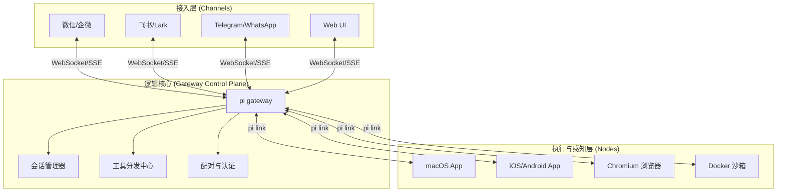

# OpenClaw - 从入门到精通

> **EXFOLIATE! EXFOLIATE!**
>
> OpenClaw 是一个强大且隐私友好的个人 AI 助手平台。它能将 AI 能力无缝接入你日常使用的通讯工具，并赋予 AI 操控浏览器、管理系统、以及在多设备间协同的能力。

---

## 📖 目录

1. [什么是 OpenClaw？](#什么是-openclaw)
2. [OpenClaw 核心架构](#openclaw-核心架构)
3. [核心特点与本地优先](#核心特点与本地优先)
4. [安装指南](#安装指南)
5. [配置详解](#配置详解)
6. [国内主流 IM 对接指南 (飞书/钉钉/企微)](#国内主流-im-对接指南-飞书钉钉企微)
7. [Canvas 画布与设备节点 (Nodes)](#canvas-画布与设备节点-nodes)
8. [进阶技巧与自动化](#进阶技巧与自动化)
9. [安全加固与生产环境部署](#安全加固与生产环境部署)
10. [常见问题与故障排除](#常见问题与故障排除)

---

## 什么是 OpenClaw？

### 核心理念

OpenClaw 的设计理念是打造一个**本地优先 (Local-First)、隐私友好 (Privacy-Friendly)** 的全能个人助手：

- **数据自主**：核心 Gateway 运行在你的私有设备上，对话历史和文件数据由你掌控。
- **多端触达**：一个助手，覆盖 WhatsApp、Telegram、飞书、企业微信、钉钉、Slack 等 20+ 渠道。
- **物理行动力**：不仅是聊天框。它能控制浏览器执行任务、调取手机相机拍照、录制屏幕或执行系统 Shell 命令。

### 命令入口演变

> [!NOTE]
> 项目最初名为 Warelay，后经历了多次迭代。目前的稳定 CLI 命令已全面转向 `pi`（即个人智能，Personal Intelligence），但为了兼容性，`openclaw` 命令在大多数环境下依然有效。本教程将以最新的 `pi` 命令作为标准。

---

## OpenClaw 核心架构

OpenClaw 采用了**控制平面 (Gateway) 与 接入点 (Nodes/Channels)** 分离的现代架构。



---

## 核心特点与本地优先

### 1. 本地 LLM 支持 (Ollama/vLLM)

虽然 OpenClaw 完美支持 Anthropic 和 OpenAI，但它的灵魂在于**本地模型**。

- **隐私至上**：通过 Ollama 连接本地 Llama 3 或 Qwen 模型，实现 100% 断网运行。
- **高性价比**：利用本地算力，免除 Token 费用。

### 2. Canvas 可视化画布

不同于传统的聊天流，OpenClaw 会开启一个名为 **Canvas** 的工作区。
- **Agent 手绘**：AI 可以在画布上动态绘制流程图、UI 原型或生成数据报表。
- **所见即所得**：用户可以直接点击画布上的元素与 AI 交互，实现空间化的协作。

---

## 安装指南

### 快捷安装 (推荐)

```bash
# 全局安装最新版 pi
npm install -g openclaw@latest

# 运行初始化向导（会自动配置 daemon 守护进程）
pi onboard
```

### 验证安装

```bash
# 检查环境健康状况
pi doctor

# 启动服务端（端口默认为 18789）
pi gateway
```

---

## 配置详解

### 1. 本地模型配置 (Ollama 示例)

在 `~/.openclaw/openclaw.json` 中配置本地模型端口：

```json
{
  "agent": {
    "model": "ollama/qwen2.5:7b"
  },
  "models": {
    "providers": {
      "ollama": {
        "url": "http://localhost:11434"
      }
    }
  }
}
```

### 2. 国内主流大模型（Qwen/Minimax/GLM/DeepSeek）

> [!NOTE]
> OpenClaw 通过其强大的 `providers` 系统，可以轻松接入任何兼容 OpenAI 格式的国内模型。

#### A. 通义千问 (Qwen - 阿里巴巴)
- **Base URL**: `https://dashscope.aliyuncs.com/compatible-mode/v1`
- **模型推荐**: `qwen-max`, `qwen-plus`, `qwen-turbo`

```json
"qwen": {
  "type": "openai",
  "url": "https://dashscope.aliyuncs.com/compatible-mode/v1",
  "apiKey": "${QWEN_API_KEY}"
}
```

#### B. 智谱清言 (GLM - 智谱 AI)
- **Base URL**: `https://open.bigmodel.cn/api/paas/v4/`
- **模型推荐**: `glm-4`, `glm-4-flash`

```json
"zhipu": {
  "type": "openai",
  "url": "https://open.bigmodel.cn/api/paas/v4/",
  "apiKey": "${ZHIPU_API_KEY}"
}
```

#### C. Minimax (海螺 AI)
- **Base URL**: `https://api.minimax.chat/v1`
- **模型推荐**: `abab6.5-chat`, `abab6.5s-chat`

```json
"minimax": {
  "type": "openai",
  "url": "https://api.minimax.chat/v1",
  "apiKey": "${MINIMAX_API_KEY}"
}
```

#### D. DeepSeek (深度求索)
- **Base URL**: `https://api.deepseek.com`
- **模型推荐**: `deepseek-chat`, `deepseek-coder`

```json
"deepseek": {
  "type": "openai",
  "url": "https://api.deepseek.com",
  "apiKey": "${DEEPSEEK_API_KEY}"
}
```

### 3. 高级 Agent 工作空间

```json
{
  "agent": {
    "workspace": "~/.openclaw/workspace",
    "allowFileAccess": true,
    "systemPrompt": "你是一个部署在本地的超级助理，你的名字叫 Claw..."
  }
}
```

---

## 国内主流 IM 对接指南 (飞书/钉钉/企微)

OpenClaw 对国内开发者非常友好，支持通过自建机器人或企业协议接入。

### 1. 飞书 (Feishu/Lark) 配置

> [!TIP]
> 飞书建议创建一个"企业自建应用"，并开启"机器人"能力。

**环境变量配置：**
```bash
FEISHU_APP_ID="cli_********"
FEISHU_APP_SECRET="********"
FEISHU_VERIFICATION_TOKEN="********"
```

**JSON 配置：**
```json
{
  "channels": {
    "feishu": {
      "appId": "${FEISHU_APP_ID}",
      "appSecret": "${FEISHU_APP_SECRET}",
      "encryptKey": "...",
      "verificationToken": "${FEISHU_VERIFICATION_TOKEN}"
    }
  }
}
```

### 2. 钉钉 (DingTalk) 自定义机器人

支持通过 Webhook 和 加签安全设置。

```json
{
  "channels": {
    "dingtalk": {
      "token": "机器人 Webhook 的 access_token",
      "secret": "加签模式下的密钥"
    }
  }
}
```

### 3. 企业微信 (WeCom)

常用的接入方式是作为"内部应用"开发。

```json
{
  "channels": {
    "wecom": {
      "corpId": "ID",
      "agentId": 1000001,
      "secret": "SECRET",
      "token": "验证 Token",
      "encodingAESKey": "AES 密钥"
    }
  }
}
```

---

## Canvas 画布与设备节点 (Nodes)

### Node 管理

你可以将你的旧 Android 手机或 iPad 变成 OpenClaw 的一个**物理感知点**。

1. 在手机上安装 OpenClaw App。
2. 在终端执行 `pi link` 生成配对码。
3. 在手机端输入配对码。
4. **效果**：你可以问 Claude：“我现在在哪里？”，它会调用手机 Node 获取 GPS；或者说：“帮我拍张工作台的照片”，它会调取手机相机并返回到当前会话。

### Canvas 交互

当你在 WebChat UI 或 iOS 应用中打开 **Canvas** 时：
- **拖拽文件**：直接将代码或文档拖入画布，Agent 会自动感知并开始分析。
- **可视化调试**：浏览器自动化的过程会在 Canvas 的子窗口中实时流式播放（非 Headless 模式）。

---

## 进阶技巧与自动化

### 1. 命令注入自动化

OpenClaw 支持在消息模板中注入实时系统数据：

```json
{
  "cron": {
    "jobs": [
      {
        "id": "daily-report",
        "schedule": "0 9 * * *",
        "action": {
          "type": "message",
          "template": "目前的系统负载是：!`uptime`，请帮我分析是否正常。"
        }
      }
    ]
  }
}
```

### 2. 多会话协同 (Sessions)

使用 `sessions_send` 工具，可以让一个专注于爬虫的 Agent 将数据传给另一个专注于数据清洗的 Agent，实现多 Agent 流水线。

---

## 安全加固与生产环境部署

### SSL/TLS 证书配置 (HTTPS)

如果你的 Gateway 需要公开访问，**必须**配置 SSL 以保护 WebSocket 数据。

```json
{
  "gateway": {
    "https": {
      "key": "/path/to/privkey.pem",
      "cert": "/path/to/fullchain.pem"
    }
  }
}
```

### 细粒度权限控制 (Permissions)

防止非法调用昂贵工具：

```json
{
  "agents": {
    "defaults": {
      "permissionPolicy": "whitelist",
      "allowedTools": ["read_file", "search_web", "canvas_*"]
    }
  }
}
```

---

## 常见问题与故障排除

### Q: Windows 下运行出现权限错误？
**A**: 强烈推荐在 **WSL2** (Ubuntu) 下运行。如果必须在原生 Windows 运行，请使用管理员权限开启 PowerShell，并确保已安装 `windows-build-tools`。

### Q: 机器人无法收到消息回调？
**A**: 确保你的 Gateway 端口（默认 18789）在防火墙中已开放，或者使用了公网映射工具（如 Tailscale Funnel, Cloudflare Tunnel）。

---

## 快速参考卡片

### 常用命令
| 命令 | 说明 |
|------|------|
| `pi gateway` | 启动核心服务端 |
| `pi doctor` | 检查环境配置与依赖 |
| `pi sessions list` | 监控活跃会话 |
| `pi onboard` | 初始化配置向导 |
| `pi shell` | 进入交互式命令行交互 |

### 官方资源
- **官网**: [openclaw.ai](https://openclaw.ai)
- **文档**: [docs.openclaw.ai](https://docs.openclaw.ai)
- **GitHub**: [openclaw/openclaw](https://github.com/openclaw/openclaw)

---

*最后更新：2026-03-07*
*作者：Jerry*
*更多教程请参考 [ai-coding 对照索引](../README.md)*