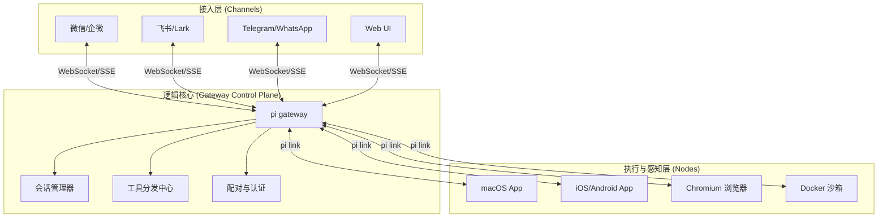

# OpenClaw - 从入门到精通

> **EXFOLIATE! EXFOLIATE!**
>
> OpenClaw 是一个强大且隐私友好的个人 AI 助手平台。它能将 AI 能力无缝接入你日常使用的通讯工具，并赋予 AI 操控浏览器、管理系统、以及在多设备间协同的能力。

---

## 📖 目录

1. [什么是 OpenClaw？](#什么是-openclaw)
2. [OpenClaw 核心架构](#openclaw-核心架构)
3. [核心特点与本地优先](#核心特点与本地优先)
4. [安装指南](#安装指南)
5. [配置详解](#配置详解)
6. [国内主流 IM 对接指南 (飞书/钉钉/企微)](#国内主流-im-对接指南-飞书钉钉企微)
7. [实战 SOP：打造 24 小时钉钉助理](#实战-sop打造-24-小时钉钉助理)
8. [Canvas 画布与设备节点 (Nodes)](#canvas-画布与设备节点-nodes)
9. [进阶技巧与自动化](#进阶技巧与自动化)
10. [安全加固与生产环境部署](#安全加固与生产环境部署)
11. [常见问题与故障排除](#常见问题与故障排除)

---

## 什么是 OpenClaw？

### 核心理念

OpenClaw 的设计理念是打造一个**本地优先 (Local-First)、隐私友好 (Privacy-Friendly)** 的全能个人助手：

- **数据自主**：核心 Gateway 运行在你的私有设备上，对话历史和文件数据由你掌控。
- **多端触达**：一个助手，覆盖 WhatsApp、Telegram、飞书、企业微信、钉钉、Slack 等 20+ 渠道。
- **物理行动力**：不仅是聊天框。它能控制浏览器执行任务、调取手机相机拍照、录制屏幕或执行系统 Shell 命令。

### 命令入口演变

> [!NOTE]
> 项目最初名为 Warelay，后经历了多次迭代。目前的稳定 CLI 命令已全面转向 `pi`（即个人智能，Personal Intelligence），但为了兼容性，`openclaw` 命令在大多数环境下依然有效。本教程将以最新的 `pi` 命令作为标准。

---

## OpenClaw 核心架构

OpenClaw 采用了**控制平面 (Gateway) 与 接入点 (Nodes/Channels)** 分离的现代架构。



---

## 核心特点与本地优先

### 1. 本地 LLM 支持 (Ollama/vLLM)

虽然 OpenClaw 完美支持 Anthropic 和 OpenAI，但它的灵魂在于**本地模型**。

- **隐私至上**：通过 Ollama 连接本地 Llama 3 或 Qwen 模型，实现 100% 断网运行。
- **高性价比**：利用本地算力，免除 Token 费用。

### 2. Canvas 可视化画布

不同于传统的聊天流，OpenClaw 会开启一个名为 **Canvas** 的工作区。
- **Agent 手绘**：AI 可以在画布上动态绘制流程图、UI 原型或生成数据报表。
- **所见即所得**：用户可以直接点击画布上的元素与 AI 交互，实现空间化的协作。

---

## 安装指南

### 快捷安装 (推荐)

```bash
# 全局安装最新版 pi
npm install -g openclaw@latest

# 运行初始化向导（会自动配置 daemon 守护进程）
pi onboard
```

### 验证安装

```bash
# 检查环境健康状况
pi doctor

# 启动服务端（端口默认为 18789）
pi gateway
```

---

## 配置详解

### 1. 本地模型配置 (Ollama 示例)

在 `~/.openclaw/openclaw.json` 中配置本地模型端口：

```json
{
  "agent": {
    "model": "ollama/qwen2.5:7b"
  },
  "models": {
    "providers": {
      "ollama": {
        "url": "http://localhost:11434"
      }
    }
  }
}
```

### 2. 国内主流大模型（Qwen/Minimax/GLM/DeepSeek）

> [!NOTE]
> OpenClaw 通过其强大的 `providers` 系统，可以轻松接入任何兼容 OpenAI 格式的国内模型。

#### A. 通义千问 (Qwen - 阿里巴巴)
- **Base URL**: `https://dashscope.aliyuncs.com/compatible-mode/v1`
- **模型推荐**: `qwen-max`, `qwen-plus`, `qwen-turbo`

```json
"qwen": {
  "type": "openai",
  "url": "https://dashscope.aliyuncs.com/compatible-mode/v1",
  "apiKey": "${QWEN_API_KEY}"
}
```

#### B. 智谱清言 (GLM - 智谱 AI)
- **Base URL**: `https://open.bigmodel.cn/api/paas/v4/`
- **模型推荐**: `glm-4`, `glm-4-flash`

```json
"zhipu": {
  "type": "openai",
  "url": "https://open.bigmodel.cn/api/paas/v4/",
  "apiKey": "${ZHIPU_API_KEY}"
}
```

#### C. Minimax (海螺 AI)
- **Base URL**: `https://api.minimax.chat/v1`
- **模型推荐**: `abab6.5-chat`, `abab6.5s-chat`

```json
"minimax": {
  "type": "openai",
  "url": "https://api.minimax.chat/v1",
  "apiKey": "${MINIMAX_API_KEY}"
}
```

#### D. DeepSeek (深度求索)
- **Base URL**: `https://api.deepseek.com`
- **模型推荐**: `deepseek-chat`, `deepseek-coder`

```json
"deepseek": {
  "type": "openai",
  "url": "https://api.deepseek.com",
  "apiKey": "${DEEPSEEK_API_KEY}"
}
```

### 3. 高级 Agent 工作空间

```json
{
  "agent": {
    "workspace": "~/.openclaw/workspace",
    "allowFileAccess": true,
    "systemPrompt": "你是一个部署在本地的超级助理，你的名字叫 Claw..."
  }
}
```

---

## 国内主流 IM 对接指南 (飞书/钉钉/企微)

由于国内网络环境和平台政策，对接 OpenClaw 建议使用**企业自建应用**模式。

### 1. 飞书 (Feishu / Lark) —— 推荐首选

飞书的机器人接口最为开放且交互体验最佳。

**操作步骤：**
1.  **创建应用**：登录 [飞书开放平台](https://open.feishu.cn/) -> “创建企业自建应用”。
2.  **启用机器人**：在应用详情页 -> “添加应用能力” -> 开启“机器人”功能。
3.  **获取密钥**：在“凭证与基础信息”中获取 `App ID` 和 `App Secret`。
4.  **配置事件订阅**：
    - 在“事件订阅”页面，设置请求地址：`https://你的公网域名/webhook/feishu`。
    - 在“添加事件”中勾选：`接收消息` (或 `im.message.receive_v1`)。
    - **域名校验**：OpenClaw 保持运行状态下，点击飞书页面的“保存”，OpenClaw 会自动处理 Challenge 校验。
5.  **权限设置**：在“权限管理”中勾选 `message:api` 相关权限（发送/接收消息）。
6.  **发布应用**：在“版本管理与发布”中，创建一个版本并申请在企业内上线。

---

### 2. 钉钉 (DingTalk) —— 无需公网 IP (Stream 模式)

强烈推荐使用钉钉企业内部应用的 **Stream (流式) 模式**，它采用长连接机制，**完全不需要配置公网 IP、内网穿透或 HTTPS 证书**。

**操作步骤：**
1.  **创建应用**：登录 [钉钉开发者后台](https://open-dev.dingtalk.com/) -> “应用开发” -> “企业内部开发” -> 创建应用并添加“机器人”能力。
2.  **开启 Stream 模式**：
    - 在机器人配置的“消息接收模式”中，选择 **Stream 模式**（这是免内网穿透的关键）。
3.  **获取密钥参数**：在应用详情的“凭证与基础信息”中，获取 `Client ID` (即 AppKey) 和 `Client Secret` (即 AppSecret)。
4.  **配置 OpenClaw 密钥**：在 `openclaw.json` 中添加配置：
    ```json
    "channels": {
      "dingtalk": {
        "clientId": "${DING_CLIENT_ID}",
        "clientSecret": "${DING_CLIENT_SECRET}"
      }
    }
    ```
5.  **发布应用**：在后台完成版本发布上线。

---

### 3. 企业微信 (WeCom)

企微的交互机制较为严格，主要通过“接收消息服务器”完成。

**操作步骤：**
1.  **管理后台**：登录 [企业微信管理后台](https://work.weixin.qq.com/) -> “应用管理” -> “自建”。
2.  **API 接收消息**：
    - 点击“接收消息” -> “设置 API 接收”。
    - **URL**：`https://你的域名/webhook/wecom`。
    - **Token / EncodingAESKey**：点击“随机生成”并记录。
3.  **获取 Secret**：获取该应用的 `AgentId` 和 `Secret`。
4.  **连接校验**：在填好 URL 并点击保存时，OpenClaw 会作为后端处理 GET 请求的验证（必须在公网可访问状态下操作）。

---

### 4. 关键：网络穿透与公网访问 (适用飞书/企微)

飞书和企微的 Webhook 必须通过 **HTTPS** 访问（**钉钉 Stream 模式可完全跳过此步**）。如果你在本地运行 OpenClaw，建议使用以下方案：

- **方案 A (简单)**：使用 **Tailscale Funnel**。将本地端口直接映射到 Tailscale 提供的公网域名。
- **方案 B (稳定)**：使用 **Cloudflare Tunnel (cloudflared)**。无需公网 IP，安全且自带 HTTPS。
- **方案 C (可控)**：使用具有公网 IP 的 VPS，配合 **Caddy** 或 **Nginx** 反向代理：
  ```caddy
  # Caddyfile 示例
  your-domain.com {
      reverse_proxy localhost:18789
  }
  ```

---

## 实战 SOP：打造 24 小时钉钉助理

为了让 OpenClaw 真正发挥作用，我们需要将其转变为一个**永不掉线、开机自启的后台守护进程 (Daemon)**。

### 第一步：环境与模型就绪
确保已完成基本的模型配置（推荐本地 Ollama 或支持 API 调用的国内大模型，如 Qwen）。

### 第二步：钉钉应用白名单与指令授权
确保已完成上述钉钉的 Stream 模式配置。同时，如果你需要让它执行系统命令或搜索网页，在 `openclaw.json` 的 `agents` 段中必须明确授权工具白名单：
```json
{
  "agents": {
    "dingtalk_agent": {
      "allowedTools": ["bash", "read_file", "search_web", "browser_*"]
    }
  }
}
```

### 第三步：配置守护进程保活 (Daemon)
在生产环境中，**不要直接运行 `pi gateway`**（关掉终端服务就停了）。推荐使用 PM2 来管理它。

**使用 PM2 (推荐)**：
```bash
# 全局安装 PM2
npm install -g pm2

# 启动 OpenClaw 并命名为 pi-gateway
pm2 start pi --name pi-gateway -- gateway

# 设置开机自启
pm2 startup
pm2 save
```

### 第四步：日常运维指令
现在你的钉钉助理已经 24 小时在线了。遇到问题时，请使用以下关键命令进行排错和维护：
- `pm2 status`: 查看 OpenClaw 是否正在后台正常运行。
- `pm2 logs pi-gateway`: **排障核心命令**。实时查看 AI 思考的日志（如果 AI 回复慢或报错，通常能在这里看到类似“API 额度不足”或“工具调用失败”的具体原因）。
- `pm2 restart pi-gateway`: 每次修改 `openclaw.json` 配置后，必须执行此命令以重启生效。

---

## Canvas 画布与设备节点 (Nodes)

### Node 管理

你可以将你的旧 Android 手机或 iPad 变成 OpenClaw 的一个**物理感知点**。

1. 在手机上安装 OpenClaw App。
2. 在终端执行 `pi link` 生成配对码。
3. 在手机端输入配对码。
4. **效果**：你可以问 Claude：“我现在在哪里？”，它会调用手机 Node 获取 GPS；或者说：“帮我拍张工作台的照片”，它会调取手机相机并返回到当前会话。

### Canvas 交互

当你在 WebChat UI 或 iOS 应用中打开 **Canvas** 时：
- **拖拽文件**：直接将代码或文档拖入画布，Agent 会自动感知并开始分析。
- **可视化调试**：浏览器自动化的过程会在 Canvas 的子窗口中实时流式播放（非 Headless 模式）。

---

## 进阶技巧与自动化

### 1. 命令注入自动化

OpenClaw 支持在消息模板中注入实时系统数据：

```json
{
  "cron": {
    "jobs": [
      {
        "id": "daily-report",
        "schedule": "0 9 * * *",
        "action": {
          "type": "message",
          "template": "目前的系统负载是：!`uptime`，请帮我分析是否正常。"
        }
      }
    ]
  }
}
```

### 2. 多会话协同 (Sessions)

使用 `sessions_send` 工具，可以让一个专注于爬虫的 Agent 将数据传给另一个专注于数据清洗的 Agent，实现多 Agent 流水线。

---

## 实战：通过钉钉实现远程命令执行

这是 OpenClaw 最具威力的使用场景之一：将钉钉变成一个**带 AI 脑子的远程 SSH 终端**。

### 1. 钉钉侧高级配置

> [!CAUTION]
> 远程执行命令具有极高风险，请严格遵循以下步骤。

1. **选择接入方式**：推荐使用“企业自建应用”，因为它支持更完整的交互能力。
2. **设置安全白名单**：
   - 在钉钉开发者后台，将你的控制端手机号或钉钉 ID 加入**应用访问白名单**。
   - 配置“消息推送” URL 指向你的 OpenClaw Gateway。

### 2. OpenClaw 侧权限开启

默认情况下，OpenClaw 禁止 AI 自由执行 Shell 命令。你需要在 `openclaw.json` 中手动为钉钉会话授予 `bash` 工具权限。

```json
{
  "agents": {
    "dingtalk_agent": {
      "allowedTools": ["bash", "read_file", "search_web"],
      "sandbox": {
        "mode": "docker"  // 强烈建议在 Docker 容器中执行命令以防系统崩溃
      }
    }
  }
}
```

### 3. 应用场景演示

配置完成后，你可以在钉钉 App 中通过文字指令控制你的服务器：

- **典型指令一：查询服务状态**
  - **用户**：`查询当前 Nginx 服务是否在运行，如果挂了请尝试重启。`
  - **AI 响应**：`正在通过 bash 执行：systemctl status nginx... 状态显示为 inactive。尝试重启中... 重启成功，目前服务已恢复。`

- **典型指令二：系统巡检**
  - **用户**：`服务器现在卡吗？看看 CPU 占用前五的进程。`
  - **AI 响应**：`当前负载 1.25，正常。前五进程如下：1. node (15%)...`

- **典型指令三：日志分析**
  - **用户**：`帮我看看 /var/log/syslog 最后 20 行有没有关于数据库的报错。`

### 4. 关键安全建议

1. **最小权限原则**：不要以 root 用户运行 `pi gateway`。
2. **使用沙箱**：在 `openclaw.json` 中配置 `sandbox: "docker"`，AI 的所有命令都会在隔离的容器中运行。
3. **加签验证**：在钉钉配置中启用“密钥验证”，确保请求真正来自钉钉服务器。

---

## 实战：智能助理模式 (人在外，AI 帮你干活)

除了“修 Bug”，OpenClaw 还是顶级的**远程生产力助手**。即使你出门在外只带了手机，也能利用公司或家里的服务器性能帮你完成繁琐工作。

### 1. 配置准备

确保你的 `openclaw.json` 中配置了浏览器工具和可写入的工作空间：

```json
{
  "browser": {
    "enabled": true,
    "headless": true
  },
  "agent": {
    "workspace": "./my-research"
  }
}
```

### 2. 场景案例：全网调研并生成 Markdown 报告

**需求场景**：你正在外面吃饭，突然需要针对某个新技术点（如 "DeepSeek-V3 的架构创新"）写一份简报。

- **你在钉钉发送**：
  > `帮我调研一下 DeepSeek-V3 相比 V2 在架构上有哪些核心创新？请搜索至少 5 个不同的信源。最后在我的 workspace 里生成一份简洁的报告，命名为 v3-research.md。`

- **OpenClaw 的后台动作**：
  1. **联网搜索**：调用 `browser_search` 或 `browser_open` 查阅最新的行业文档、GitHub 仓库或技术博客。
  2. **深度阅读**：使用浏览器镜像识别或文本抓取技术，理解复杂的 PDF 或长文。
  3. **逻辑总结**：将碎片化信息整合为结构化内容。
  4. **文件生成**：调用 `write_file` 工具，将报告物理地写入你的服务器硬盘。

- **AI 响应**：
  > `主人，调研已完成！我查阅了深度求索官网、arXiv 论文和 3 篇深度技术解析。报告已生成：`
  > `✅ 文件路径：my-research/v3-research.md`
  > `📊 核心要点：1. MLA 架构优化；2. 负载均衡策略升级...`

### 3. 核心价值：真正的“数字分身”

这种模式下，你不再是和 AI 聊天，而是**下达任务 (Delegation)**。当你回到家打开电脑时，调研报告已经在你的 VS Code 里准备好了。

---

## 安全加固与生产环境部署

### SSL/TLS 证书配置 (HTTPS)

如果你的 Gateway 需要公开访问，**必须**配置 SSL 以保护 WebSocket 数据。

```json
{
  "gateway": {
    "https": {
      "key": "/path/to/privkey.pem",
      "cert": "/path/to/fullchain.pem"
    }
  }
}
```

### 细粒度权限控制 (Permissions)

防止非法调用昂贵工具：

```json
{
  "agents": {
    "defaults": {
      "permissionPolicy": "whitelist",
      "allowedTools": ["read_file", "search_web", "canvas_*"]
    }
  }
}
```

---

## 常见问题与故障排除

### Q: Windows 下运行出现权限错误？
**A**: 强烈推荐在 **WSL2** (Ubuntu) 下运行。如果必须在原生 Windows 运行，请使用管理员权限开启 PowerShell，并确保已安装 `windows-build-tools`。

### Q: 机器人无法收到消息回调？
**A**: 确保你的 Gateway 端口（默认 18789）在防火墙中已开放，或者使用了公网映射工具（如 Tailscale Funnel, Cloudflare Tunnel）。

---

## 快速参考卡片

### 常用命令
| 命令 | 说明 |
|------|------|
| `pi gateway` | 启动核心服务端 |
| `pi doctor` | 检查环境配置与依赖 |
| `pi sessions list` | 监控活跃会话 |
| `pi onboard` | 初始化配置向导 |
| `pi shell` | 进入交互式命令行交互 |

### 官方资源
- **官网**: [openclaw.ai](https://openclaw.ai)
- **文档**: [docs.openclaw.ai](https://docs.openclaw.ai)
- **GitHub**: [openclaw/openclaw](https://github.com/openclaw/openclaw)

---

*最后更新：2026-03-07*
*作者：Jerry*
*更多教程请参考 [ai-coding 对照索引](../README.md)*